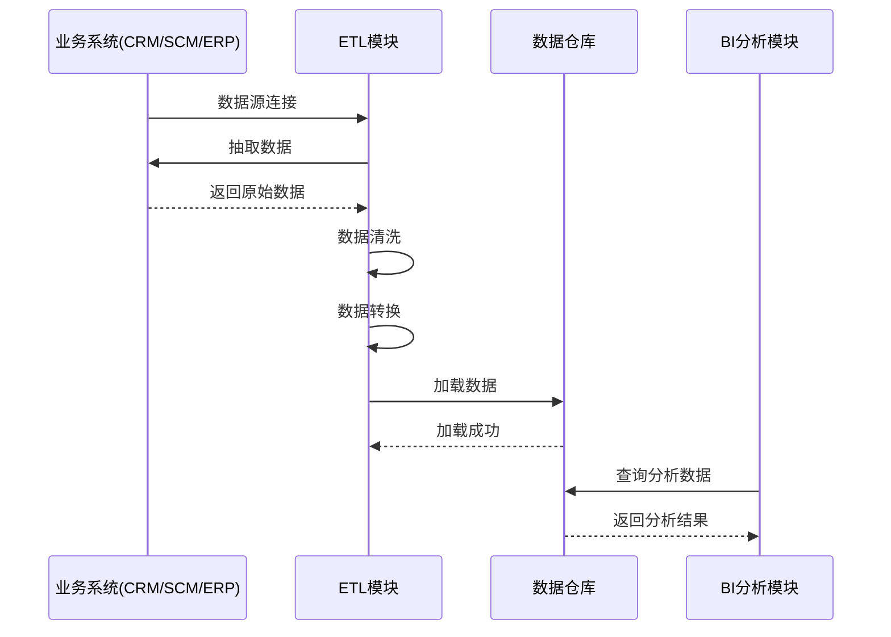
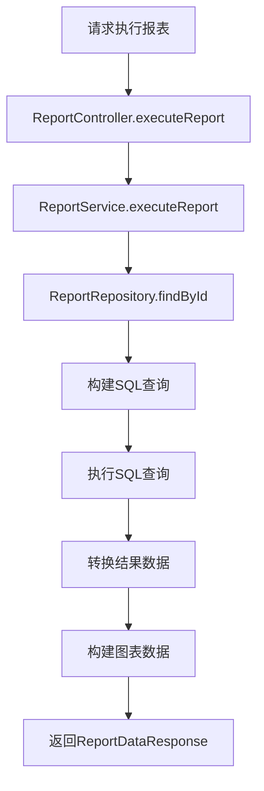
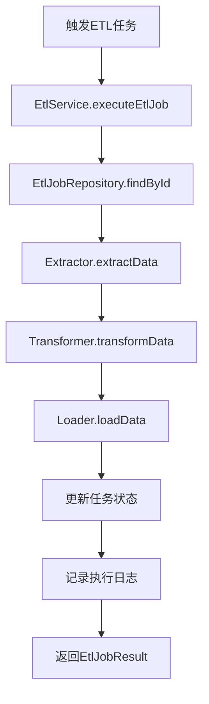

# BI数据分析系统设计文档

## 1. 文档概述

### 1.1 文档目的
本文档详细描述BI（Business Intelligence）数据分析系统的设计方案，包括系统架构、功能模块、API接口、数据模型等，为系统开发和部署提供技术依据。

### 1.2 系统定位
BI系统作为企业级应用体系的数据分析平台，负责整合各业务系统数据，提供数据可视化、报表分析、数据挖掘等功能，支持企业决策分析。

### 1.3 文档版本
| 版本 | 日期 | 作者 | 变更说明 |
| --- | --- | --- | --- |
| V1.0 | 2026-06-03 | 架构组 | 初始版本 |

---

## 2. 需求分析

### 2.1 功能需求

| 序号 | 需求点 | 需求描述 | 优先级 |
| --- | --- | --- | --- |
| 1 | 数据采集 | 从各业务系统抽取数据 | 高 |
| 2 | 数据仓库 | 数据存储、清洗、转换 | 高 |
| 3 | 报表中心 | 自定义报表、固定报表 | 高 |
| 4 | 数据可视化 | 图表展示、仪表盘 | 高 |
| 5 | 数据挖掘 | 趋势分析、预测分析 | 中 |
| 6 | 数据预警 | 异常检测、预警通知 | 中 |
| 7 | 数据权限 | 基于角色的数据访问控制 | 高 |

### 2.2 非功能需求

| 类别 | 要求 |
| --- | --- |
| 性能 | 报表查询响应时间 < 5秒 |
| 可用性 | 99.9%高可用 |
| 安全性 | 符合等保2.0三级要求 |
| 扩展性 | 支持大数据量处理 |

---

## 3. 系统架构设计

### 3.1 架构风格
- **分层架构**: 数据采集层、数据处理层、数据分析层、展示层
- **批处理+实时**: 支持批量ETL和实时数据流

### 3.2 模块划分

| 模块 | 职责 | 说明 |
| --- | --- | --- |
| 数据采集模块 | 数据抽取 | 从各业务系统抽取数据 |
| ETL模块 | 数据处理 | 数据清洗、转换、加载 |
| 数据仓库模块 | 数据存储 | 事实表、维度表存储 |
| 报表模块 | 报表生成 | 自定义报表、固定报表 |
| 可视化模块 | 图表展示 | 仪表盘、图表组件 |
| 分析模块 | 数据分析 | 数据挖掘、预测分析 |

### 3.3 核心流程图

#### 3.3.1 ETL数据处理流程



---

## 4. 目录结构

```plaintext
backend/                              # 后端服务
  ├── src/
  │   ├── main/
  │   │   ├── java/com/example/bi/
  │   │   │   ├── controller/         # REST API控制层
  │   │   │   │   ├── ReportController.java    # 报表管理
  │   │   │   │   ├── DashboardController.java # 仪表盘管理
  │   │   │   │   └── DataController.java      # 数据接口
  │   │   │   ├── service/            # 业务逻辑层
  │   │   │   │   ├── EtlService.java
  │   │   │   │   ├── ReportService.java
  │   │   │   │   ├── DashboardService.java
  │   │   │   │   └── AnalysisService.java
  │   │   │   ├── repository/         # 数据访问层
  │   │   │   │   ├── ReportRepository.java
  │   │   │   │   └── DashboardRepository.java
  │   │   │   ├── entity/             # 数据库实体
  │   │   │   │   ├── Report.java
  │   │   │   │   ├── Dashboard.java
  │   │   │   │   └── Widget.java
  │   │   │   ├── dto/                # 数据传输对象
  │   │   │   │   ├── request/
  │   │   │   │   └── response/
  │   │   │   ├── config/             # 配置类
  │   │   │   │   ├── SecurityConfig.java
  │   │   │   │   └── EtlConfig.java
  │   │   │   ├── etl/                # ETL模块
  │   │   │   │   ├── Extractor.java
  │   │   │   │   ├── Transformer.java
  │   │   │   │   └── Loader.java
  │   │   │   ├── client/             # 外部服务调用
  │   │   │   │   ├── CrmClient.java
  │   │   │   │   ├── ScmClient.java
  │   │   │   │   └── ErpClient.java
  │   │   │   └── BiApplication.java  # 启动类
  │   └── resources/
  │       ├── application.yml         # 应用配置
  │       └── schema.sql              # 数据库初始化脚本
  └── pom.xml                         # Maven配置

frontend/                             # 前端管理后台
  ├── src/
  │   ├── components/                 # 公共组件
  │   │   ├── charts/                 # 图表组件
  │   │   │   ├── BarChart.vue
  │   │   │   ├── LineChart.vue
  │   │   │   └── PieChart.vue
  │   ├── views/                      # 页面
  │   │   ├── dashboard/              # 仪表盘
  │   │   │   └── index.vue
  │   │   ├── report/                 # 报表管理
  │   │   │   ├── list.vue
  │   │   │   └── designer.vue
  │   │   └── analysis/               # 数据分析
  │   │       └── index.vue
  │   ├── api/                        # API封装
  │   ├── store/                      # 状态管理
  │   └── main.ts                     # 入口文件
  └── package.json                    # 依赖配置
```

---

## 5. 关键类与方法设计

### 5.1 核心服务类

#### 5.1.1 EtlService (ETL服务)

| 方法名 | 功能说明 | 参数 | 返回值 | 失败返回 |
| --- | --- | --- | --- | --- |
| `extractData` | 抽取数据 | `String sourceSystem, String tableName` | `List<Map<String, Object>>` | 抛出`ExtractException` |
| `transformData` | 转换数据 | `List<Map<String, Object>> data, String mappingConfig` | `List<Map<String, Object>>` | - |
| `loadData` | 加载数据 | `String targetTable, List<Map<String, Object>> data` | `LoadResult` | 抛出`LoadException` |
| `executeEtlJob` | 执行ETL任务 | `String jobName` | `EtlJobResult` | 抛出`EtlJobException` |

#### 5.1.2 ReportService (报表服务)

| 方法名 | 功能说明 | 参数 | 返回值 | 失败返回 |
| --- | --- | --- | --- | --- |
| `createReport` | 创建报表 | `ReportCreateRequest request` | `ReportResponse` | 抛出`BusinessException` |
| `executeReport` | 执行报表 | `Long reportId, Map<String, Object> params` | `ReportDataResponse` | 抛出`ReportNotFoundException` |
| `getReports` | 查询报表列表 | `ReportSearchRequest request` | `Page<ReportResponse>` | - |

#### 5.1.3 DashboardService (仪表盘服务)

| 方法名 | 功能说明 | 参数 | 返回值 | 失败返回 |
| --- | --- | --- | --- | --- |
| `createDashboard` | 创建仪表盘 | `DashboardCreateRequest request` | `DashboardResponse` | 抛出`BusinessException` |
| `addWidget` | 添加图表组件 | `Long dashboardId, WidgetCreateRequest request` | `WidgetResponse` | 抛出`DashboardNotFoundException` |
| `getDashboard` | 查询仪表盘 | `Long dashboardId` | `DashboardResponse` | 抛出`DashboardNotFoundException` |

### 5.2 DTO结构定义

#### 5.2.1 请求DTO

**ReportCreateRequest（创建报表请求）**
| 字段名 | 类型 | 含义 | 约束 |
| --- | --- | --- | --- |
| name | String | 报表名称 | 非空 |
| description | String | 报表描述 | 可选 |
| querySql | String | 查询SQL | 非空 |
| params | List<ReportParam> | 参数定义 | 可选 |
| chartType | String | 图表类型 | 可选 |

**DashboardCreateRequest（创建仪表盘请求）**
| 字段名 | 类型 | 含义 | 约束 |
| --- | --- | --- | --- |
| name | String | 仪表盘名称 | 非空 |
| description | String | 仪表盘描述 | 可选 |
| layout | String | 布局配置(JSON) | 非空 |
| widgets | List<WidgetCreateRequest> | 图表组件列表 | 可选 |

**WidgetCreateRequest（创建图表组件请求）**
| 字段名 | 类型 | 含义 | 约束 |
| --- | --- | --- | --- |
| name | String | 组件名称 | 非空 |
| chartType | String | 图表类型(BAR/PIE/LINE/TABLE) | 非空 |
| reportId | Long | 关联报表ID | 非空 |
| positionX | Integer | 位置X | 非空 |
| positionY | Integer | 位置Y | 非空 |
| width | Integer | 宽度 | 非空 |
| height | Integer | 高度 | 非空 |

#### 5.2.2 响应DTO

**ReportResponse（报表响应）**
| 字段名 | 类型 | 含义 |
| --- | --- | --- |
| id | Long | 报表ID |
| name | String | 报表名称 |
| description | String | 报表描述 |
| querySql | String | 查询SQL |
| chartType | String | 图表类型 |
| createdAt | LocalDateTime | 创建时间 |

**DashboardResponse（仪表盘响应）**
| 字段名 | 类型 | 含义 |
| --- | --- | --- |
| id | Long | 仪表盘ID |
| name | String | 仪表盘名称 |
| description | String | 仪表盘描述 |
| layout | String | 布局配置 |
| widgets | List<WidgetResponse> | 图表组件列表 |
| createdAt | LocalDateTime | 创建时间 |

**ReportDataResponse（报表数据响应）**
| 字段名 | 类型 | 含义 |
| --- | --- | --- |
| reportId | Long | 报表ID |
| reportName | String | 报表名称 |
| columns | List<String> | 列名列表 |
| rows | List<Map<String, Object>> | 数据行 |
| chartData | ChartData | 图表数据 |
| executeTime | Long | 执行时间(毫秒) |

---

## 6. 数据库与数据结构设计

### 6.1 数据库表设计

#### 6.1.1 报表表 (bi_report)

| 字段名 | 类型 | 约束 | 说明 |
| --- | --- | --- | --- |
| id | BIGINT | PRIMARY KEY, AUTO_INCREMENT | 报表ID |
| name | VARCHAR(200) | NOT NULL | 报表名称 |
| description | VARCHAR(500) | - | 报表描述 |
| query_sql | TEXT | NOT NULL | 查询SQL |
| params | TEXT | - | 参数定义(JSON) |
| chart_type | VARCHAR(50) | - | 图表类型 |
| created_by | BIGINT | NOT NULL | 创建人ID |
| created_at | DATETIME | NOT NULL | 创建时间 |
| updated_at | DATETIME | NOT NULL | 更新时间 |

#### 6.1.2 仪表盘表 (bi_dashboard)

| 字段名 | 类型 | 约束 | 说明 |
| --- | --- | --- | --- |
| id | BIGINT | PRIMARY KEY, AUTO_INCREMENT | 仪表盘ID |
| name | VARCHAR(200) | NOT NULL | 仪表盘名称 |
| description | VARCHAR(500) | - | 仪表盘描述 |
| layout | TEXT | NOT NULL | 布局配置(JSON) |
| created_by | BIGINT | NOT NULL | 创建人ID |
| created_at | DATETIME | NOT NULL | 创建时间 |
| updated_at | DATETIME | NOT NULL | 更新时间 |

#### 6.1.3 图表组件表 (bi_widget)

| 字段名 | 类型 | 约束 | 说明 |
| --- | --- | --- | --- |
| id | BIGINT | PRIMARY KEY, AUTO_INCREMENT | 组件ID |
| dashboard_id | BIGINT | FOREIGN KEY, NOT NULL | 仪表盘ID |
| name | VARCHAR(100) | NOT NULL | 组件名称 |
| chart_type | VARCHAR(50) | NOT NULL | 图表类型 |
| report_id | BIGINT | FOREIGN KEY | 报表ID |
| query_sql | TEXT | - | 自定义SQL |
| position_x | INT | NOT NULL | 位置X |
| position_y | INT | NOT NULL | 位置Y |
| width | INT | NOT NULL | 宽度 |
| height | INT | NOT NULL | 高度 |
| config | TEXT | - | 图表配置(JSON) |
| created_at | DATETIME | NOT NULL | 创建时间 |
| updated_at | DATETIME | NOT NULL | 更新时间 |

#### 6.1.4 ETL任务表 (bi_etl_job)

| 字段名 | 类型 | 约束 | 说明 |
| --- | --- | --- | --- |
| id | BIGINT | PRIMARY KEY, AUTO_INCREMENT | 任务ID |
| name | VARCHAR(200) | NOT NULL | 任务名称 |
| description | VARCHAR(500) | - | 任务描述 |
| source_system | VARCHAR(50) | NOT NULL | 来源系统 |
| source_table | VARCHAR(100) | NOT NULL | 来源表 |
| target_table | VARCHAR(100) | NOT NULL | 目标表 |
| cron_expression | VARCHAR(50) | - | 调度表达式 |
| status | VARCHAR(20) | NOT NULL | 状态 |
| created_at | DATETIME | NOT NULL | 创建时间 |
| updated_at | DATETIME | NOT NULL | 更新时间 |

---

## 7. API接口设计

### 7.1 报表管理接口

| API路径 | HTTP方法 | Controller文件 | 功能描述 |
| --- | --- | --- | --- |
| `/api/bi/reports` | GET | ReportController.java | 查询报表列表 |
| `/api/bi/reports/{id}` | GET | ReportController.java | 查询报表详情 |
| `/api/bi/reports` | POST | ReportController.java | 创建报表 |
| `/api/bi/reports/{id}` | PUT | ReportController.java | 更新报表 |
| `/api/bi/reports/{id}` | DELETE | ReportController.java | 删除报表 |
| `/api/bi/reports/{id}/execute` | POST | ReportController.java | 执行报表 |

#### 7.1.1 POST /api/bi/reports/{id}/execute

**请求体:**
```json
{
    "params": {
        "startDate": "2024-01-01",
        "endDate": "2024-06-30"
    }
}
```

**成功响应 (200):**
```json
{
    "code": 200,
    "message": "执行成功",
    "data": {
        "reportId": 1,
        "reportName": "销售报表",
        "columns": ["月份", "销售额", "订单数"],
        "rows": [
            {"月份": "1月", "销售额": 120000, "订单数": 150},
            {"月份": "2月", "销售额": 135000, "订单数": 180}
        ],
        "chartData": {
            "type": "LINE",
            "labels": ["1月", "2月"],
            "datasets": [
                {"label": "销售额", "data": [120000, 135000]}
            ]
        },
        "executeTime": 1200
    }
}
```

### 7.2 仪表盘管理接口

| API路径 | HTTP方法 | Controller文件 | 功能描述 |
| --- | --- | --- | --- |
| `/api/bi/dashboards` | GET | DashboardController.java | 查询仪表盘列表 |
| `/api/bi/dashboards/{id}` | GET | DashboardController.java | 查询仪表盘详情 |
| `/api/bi/dashboards` | POST | DashboardController.java | 创建仪表盘 |
| `/api/bi/dashboards/{id}` | PUT | DashboardController.java | 更新仪表盘 |
| `/api/bi/dashboards/{id}/widgets` | POST | DashboardController.java | 添加图表组件 |
| `/api/bi/dashboards/{id}/widgets/{widgetId}` | DELETE | DashboardController.java | 删除图表组件 |

### 7.3 ETL任务接口

| API路径 | HTTP方法 | Controller文件 | 功能描述 |
| --- | --- | --- | --- |
| `/api/bi/etl/jobs` | GET | DataController.java | 查询ETL任务列表 |
| `/api/bi/etl/jobs` | POST | DataController.java | 创建ETL任务 |
| `/api/bi/etl/jobs/{id}/execute` | POST | DataController.java | 手动执行ETL任务 |

---

## 8. 主业务流程与调用链

### 8.1 报表执行流程



### 8.2 ETL任务执行流程



---

## 9. 安全设计

### 9.1 认证机制
- 通过SSO系统进行统一身份认证
- 使用JWT令牌进行接口访问控制

### 9.2 权限控制

| 资源 | 权限 | 说明 |
| --- | --- | --- |
| 报表管理 | report:read, report:write | 查看和编辑报表 |
| 仪表盘管理 | dashboard:read, dashboard:write | 查看和编辑仪表盘 |
| ETL管理 | etl:read, etl:execute | 查看和执行ETL任务 |

---

## 10. 部署与集成方案

### 10.1 依赖与环境

| 依赖 | 版本 | 说明 |
| --- | --- | --- |
| Spring Boot | 3.2.x | 后端框架 |
| Spring Security | 6.2.x | 安全框架 |
| PostgreSQL | 15+ | 数据库 |
| Apache Spark | 3.5+ | 大数据处理 |
| Redis | 7.0+ | 缓存 |

### 10.2 配置与运行

#### application.yml 关键配置

```yaml
server:
  port: 8084

spring:
  datasource:
    url: jdbc:postgresql://localhost:5432/bi_db
    username: ${DB_USERNAME:admin}
    password: ${DB_PASSWORD:password}

  data:
    redis:
      host: localhost
      port: 6379

security:
  oauth2:
    resourceserver:
      jwt:
        issuer-uri: https://sso.example.com

feign:
  clients:
    crm-service:
      url: https://crm.example.com
    scm-service:
      url: https://scm.example.com
    erp-service:
      url: https://erp.example.com

etl:
  spark:
    master: local[*]
```

### 10.3 与其他系统集成

| 系统 | 集成方式 | 说明 |
| --- | --- | --- |
| SSO | OAuth2.0 | 统一身份认证 |
| CRM | REST API | 获取销售数据 |
| SCM | REST API | 获取采购数据 |
| ERP | REST API | 获取财务数据 |

---

**文档结束**