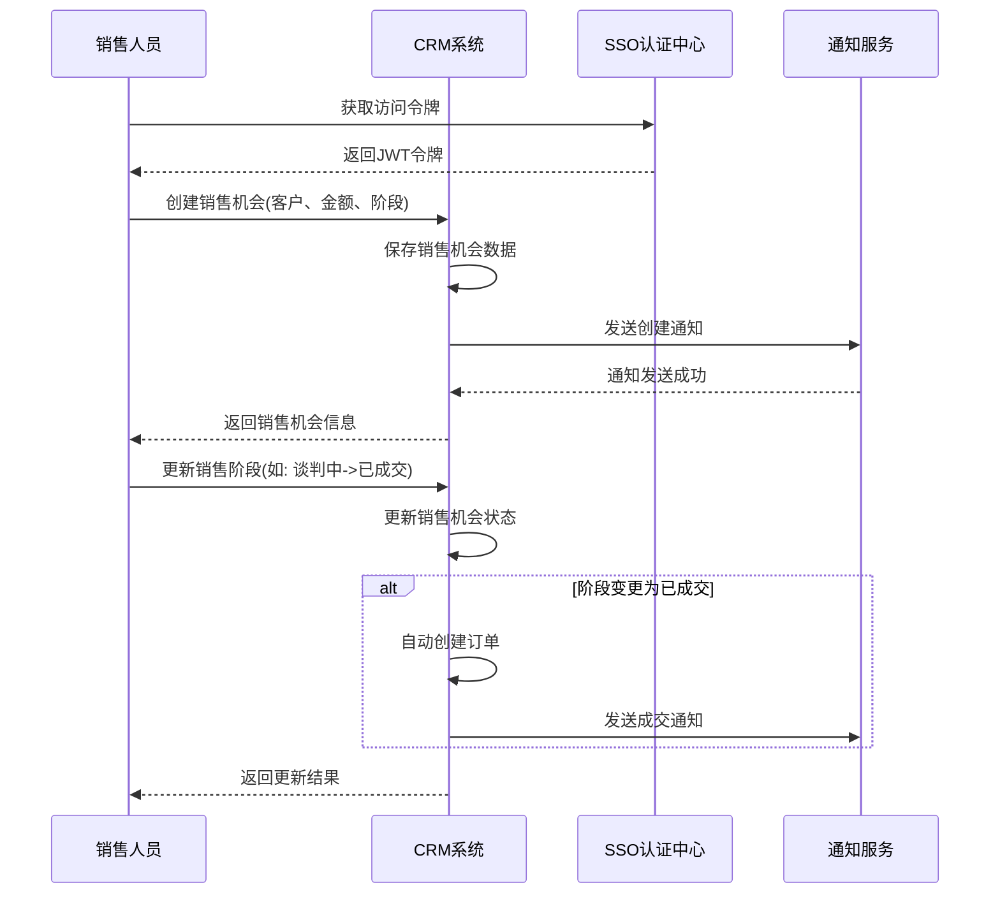
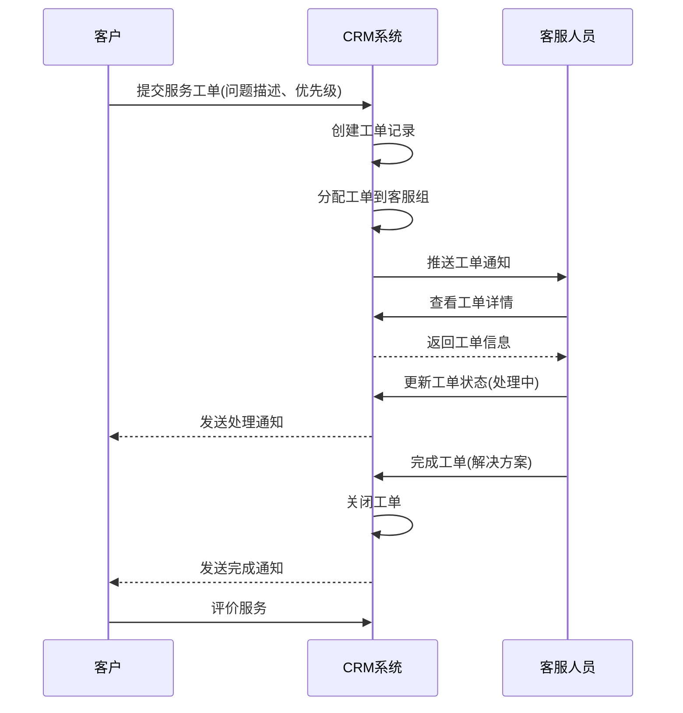
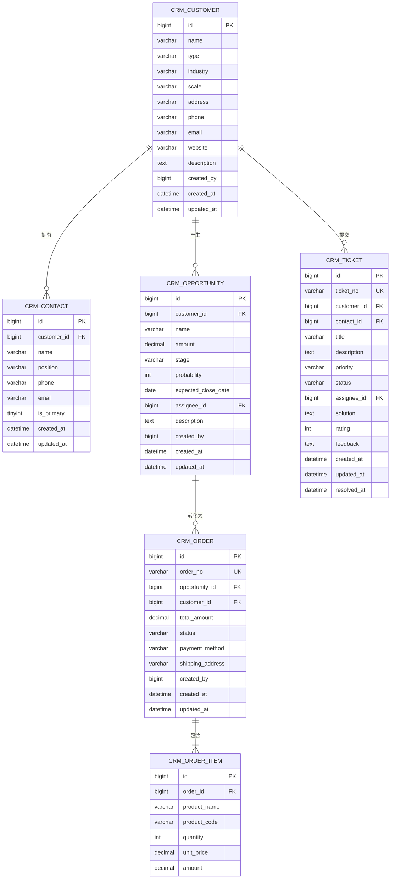
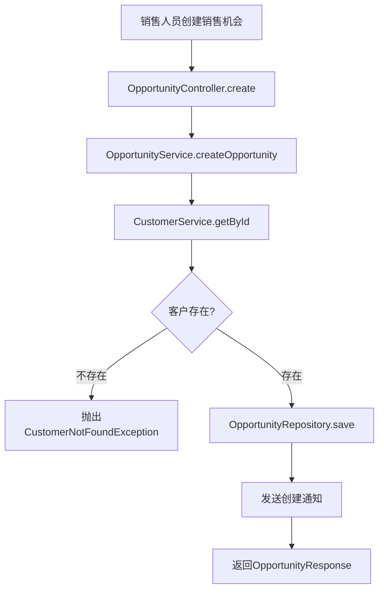
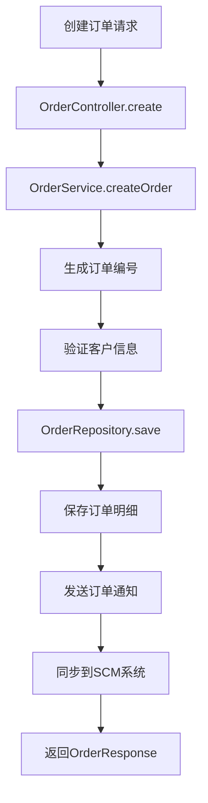

# CRM客户关系管理系统设计文档

## 1. 文档概述

### 1.1 文档目的
本文档详细描述CRM（Customer Relationship Management）客户关系管理系统的设计方案，包括系统架构、功能模块、API接口、数据模型等，为系统开发和部署提供技术依据。

### 1.2 系统定位
CRM系统作为企业级应用体系的核心业务系统，负责客户信息管理、销售自动化、营销管理和客户服务，帮助企业提升客户满意度和销售业绩。

### 1.3 文档版本
| 版本 | 日期 | 作者 | 变更说明 |
| --- | --- | --- | --- |
| V1.0 | 2026-06-03 | 架构组 | 初始版本 |

---

## 2. 需求分析

### 2.1 功能需求

| 序号 | 需求点 | 需求描述 | 优先级 |
| --- | --- | --- | --- |
| 1 | 客户管理 | 客户信息录入、查询、编辑、删除 | 高 |
| 2 | 联系人管理 | 客户联系人信息管理 | 高 |
| 3 | 销售机会 | 销售线索管理、商机跟踪 | 高 |
| 4 | 销售管道 | 销售阶段管理、漏斗分析 | 高 |
| 5 | 订单管理 | 订单创建、审核、发货、结算 | 高 |
| 6 | 客户服务 | 服务工单创建、处理、跟踪 | 高 |
| 7 | 营销自动化 | 营销活动管理、邮件群发 | 中 |
| 8 | 报表分析 | 销售报表、客户分析、业绩统计 | 中 |
| 9 | 数据导入导出 | 批量导入客户数据、导出报表 | 中 |

### 2.2 非功能需求

| 类别 | 要求 |
| --- | --- |
| 性能 | 响应时间 < 200ms，支持500+并发用户 |
| 可用性 | 99.9%高可用 |
| 安全性 | 符合等保2.0三级要求 |
| 扩展性 | 支持水平扩展，支持多租户 |

---

## 3. 系统架构设计

### 3.1 架构风格
- **微服务架构**: 独立部署，高内聚低耦合
- **事件驱动**: 通过消息队列实现系统间解耦

### 3.2 模块划分

| 模块 | 职责 | 说明 |
| --- | --- | --- |
| 客户模块 | 客户信息管理 | 客户CRUD、客户分类 |
| 联系人模块 | 联系人管理 | 联系人CRUD、关联客户 |
| 销售模块 | 销售机会管理 | 线索、商机、销售管道 |
| 订单模块 | 订单管理 | 订单创建、流程处理 |
| 服务模块 | 客户服务 | 工单管理、服务流程 |
| 营销模块 | 营销自动化 | 营销活动、邮件营销 |
| 报表模块 | 数据分析 | 报表生成、数据可视化 |

### 3.3 核心流程图

#### 3.3.1 销售机会管理流程



#### 3.3.2 客户服务工单流程



---

## 4. 目录结构

```plaintext
backend/                              # 后端服务
  ├── src/
  │   ├── main/
  │   │   ├── java/com/example/crm/
  │   │   │   ├── controller/         # REST API控制层
  │   │   │   │   ├── CustomerController.java   # 客户管理
  │   │   │   │   ├── ContactController.java    # 联系人管理
  │   │   │   │   ├── OpportunityController.java # 销售机会
  │   │   │   │   ├── OrderController.java      # 订单管理
  │   │   │   │   ├── TicketController.java     # 服务工单
  │   │   │   │   ├── CampaignController.java   # 营销活动
  │   │   │   │   └── ReportController.java     # 报表分析
  │   │   │   ├── service/            # 业务逻辑层
  │   │   │   │   ├── CustomerService.java
  │   │   │   │   ├── ContactService.java
  │   │   │   │   ├── OpportunityService.java
  │   │   │   │   ├── OrderService.java
  │   │   │   │   ├── TicketService.java
  │   │   │   │   ├── CampaignService.java
  │   │   │   │   └── ReportService.java
  │   │   │   ├── repository/         # 数据访问层
  │   │   │   │   ├── CustomerRepository.java
  │   │   │   │   ├── ContactRepository.java
  │   │   │   │   ├── OpportunityRepository.java
  │   │   │   │   ├── OrderRepository.java
  │   │   │   │   ├── TicketRepository.java
  │   │   │   │   └── CampaignRepository.java
  │   │   │   ├── entity/             # 数据库实体
  │   │   │   │   ├── Customer.java
  │   │   │   │   ├── Contact.java
  │   │   │   │   ├── Opportunity.java
  │   │   │   │   ├── Order.java
  │   │   │   │   ├── Ticket.java
  │   │   │   │   └── Campaign.java
  │   │   │   ├── dto/                # 数据传输对象
  │   │   │   │   ├── request/
  │   │   │   │   └── response/
  │   │   │   ├── config/             # 配置类
  │   │   │   │   ├── SecurityConfig.java
  │   │   │   │   └── FeignConfig.java
  │   │   │   ├── client/             # 外部服务调用
  │   │   │   │   └── SsoClient.java
  │   │   │   ├── exception/          # 异常处理
  │   │   │   │   └── GlobalExceptionHandler.java
  │   │   │   └── CrmApplication.java # 启动类
  │   └── resources/
  │       ├── application.yml         # 应用配置
  │       └── schema.sql              # 数据库初始化脚本
  └── pom.xml                         # Maven配置

frontend/                             # 前端管理后台
  ├── src/
  │   ├── components/                 # 公共组件
  │   ├── views/                      # 页面
  │   │   ├── customer/               # 客户管理
  │   │   │   ├── list.vue
  │   │   │   └── detail.vue
  │   │   ├── sales/                  # 销售管理
  │   │   │   ├── opportunity.vue
  │   │   │   └── pipeline.vue
  │   │   ├── order/                  # 订单管理
  │   │   │   ├── list.vue
  │   │   │   └── detail.vue
  │   │   ├── service/                # 客户服务
  │   │   │   └── ticket.vue
  │   │   ├── marketing/              # 营销管理
  │   │   │   └── campaign.vue
  │   │   └── report/                 # 报表中心
  │   │       └── dashboard.vue
  │   ├── api/                        # API封装
  │   ├── store/                      # 状态管理
  │   └── main.ts                     # 入口文件
  └── package.json                    # 依赖配置
```

---

## 5. 关键类与方法设计

### 5.1 核心服务类

#### 5.1.1 CustomerService (客户服务)

| 方法名 | 功能说明 | 参数 | 返回值 | 失败返回 |
| --- | --- | --- | --- | --- |
| `createCustomer` | 创建客户 | `CustomerCreateRequest request` | `CustomerResponse` | 抛出`BusinessException` |
| `updateCustomer` | 更新客户 | `Long id, CustomerUpdateRequest request` | `CustomerResponse` | 抛出`CustomerNotFoundException` |
| `deleteCustomer` | 删除客户 | `Long id` | `void` | 抛出`CustomerNotFoundException` |
| `getCustomerById` | 查询客户详情 | `Long id` | `CustomerResponse` | 抛出`CustomerNotFoundException` |
| `searchCustomers` | 搜索客户 | `CustomerSearchRequest request` | `Page<CustomerResponse>` | - |
| `importCustomers` | 批量导入客户 | `MultipartFile file` | `ImportResult` | 抛出`FileParseException` |

#### 5.1.2 OpportunityService (销售机会服务)

| 方法名 | 功能说明 | 参数 | 返回值 | 失败返回 |
| --- | --- | --- | --- | --- |
| `createOpportunity` | 创建销售机会 | `OpportunityCreateRequest request` | `OpportunityResponse` | 抛出`BusinessException` |
| `updateOpportunity` | 更新销售机会 | `Long id, OpportunityUpdateRequest request` | `OpportunityResponse` | 抛出`OpportunityNotFoundException` |
| `updateStage` | 更新销售阶段 | `Long id, String stage` | `OpportunityResponse` | 抛出`OpportunityNotFoundException` |
| `getOpportunities` | 查询销售机会列表 | `OpportunitySearchRequest request` | `Page<OpportunityResponse>` | - |
| `getSalesPipeline` | 获取销售管道 | `Long userId` | `List<PipelineStage>` | - |

#### 5.1.3 OrderService (订单服务)

| 方法名 | 功能说明 | 参数 | 返回值 | 失败返回 |
| --- | --- | --- | --- | --- |
| `createOrder` | 创建订单 | `OrderCreateRequest request` | `OrderResponse` | 抛出`BusinessException` |
| `updateOrderStatus` | 更新订单状态 | `Long id, String status` | `OrderResponse` | 抛出`OrderNotFoundException` |
| `getOrderById` | 查询订单详情 | `Long id` | `OrderResponse` | 抛出`OrderNotFoundException` |
| `searchOrders` | 搜索订单 | `OrderSearchRequest request` | `Page<OrderResponse>` | - |

### 5.2 DTO结构定义

#### 5.2.1 请求DTO

**CustomerCreateRequest（创建客户请求）**
| 字段名 | 类型 | 含义 | 约束 |
| --- | --- | --- | --- |
| name | String | 客户名称 | 非空 |
| type | String | 客户类型(企业/个人) | 非空 |
| industry | String | 所属行业 | 可选 |
| scale | String | 企业规模 | 可选 |
| address | String | 地址 | 可选 |
| phone | String | 联系电话 | 可选 |
| email | String | 邮箱 | 可选，邮箱格式 |
| website | String | 网站 | 可选，URL格式 |
| description | String | 备注说明 | 可选 |

**OpportunityCreateRequest（创建销售机会请求）**
| 字段名 | 类型 | 含义 | 约束 |
| --- | --- | --- | --- |
| customerId | Long | 客户ID | 非空 |
| name | String | 机会名称 | 非空 |
| amount | BigDecimal | 预估金额 | 非空，大于0 |
| stage | String | 销售阶段 | 非空 |
| probability | Integer | 成交概率(0-100) | 默认50 |
| expectedCloseDate | LocalDate | 预计成交日期 | 可选 |
| assigneeId | Long | 负责人ID | 可选 |
| description | String | 备注说明 | 可选 |

**OrderItem（订单商品）**
| 字段名 | 类型 | 含义 | 约束 |
| --- | --- | --- | --- |
| materialId | Long | 关联SCM物料ID | 可选 |
| productName | String | 商品名称 | 非空 |
| productCode | String | 商品编码 | 可选 |
| quantity | Integer | 数量 | 非空，大于0 |
| unitPrice | BigDecimal | 单价 | 非空，大于0 |
| amount | BigDecimal | 金额 | 非空 |

**OrderCreateRequest（创建订单请求）**
| 字段名 | 类型 | 含义 | 约束 |
| --- | --- | --- | --- |
| opportunityId | Long | 关联销售机会ID | 可选 |
| customerId | Long | 客户ID | 非空 |
| items | List<OrderItem> | 订单商品列表 | 非空 |
| totalAmount | BigDecimal | 订单总额 | 非空 |
| paymentMethod | String | 支付方式 | 非空 |
| shippingAddress | String | 收货地址 | 非空 |

#### 5.2.2 响应DTO

**CustomerResponse（客户响应）**
| 字段名 | 类型 | 含义 |
| --- | --- | --- |
| id | Long | 客户ID |
| name | String | 客户名称 |
| type | String | 客户类型 |
| industry | String | 所属行业 |
| scale | String | 企业规模 |
| address | String | 地址 |
| phone | String | 联系电话 |
| email | String | 邮箱 |
| website | String | 网站 |
| description | String | 备注说明 |
| createdAt | LocalDateTime | 创建时间 |
| updatedAt | LocalDateTime | 更新时间 |
| contacts | List<ContactSummary> | 联系人列表 |

**OpportunityResponse（销售机会响应）**
| 字段名 | 类型 | 含义 |
| --- | --- | --- |
| id | Long | 机会ID |
| name | String | 机会名称 |
| customerName | String | 客户名称 |
| amount | BigDecimal | 预估金额 |
| stage | String | 销售阶段 |
| probability | Integer | 成交概率 |
| expectedCloseDate | LocalDate | 预计成交日期 |
| assigneeName | String | 负责人名称 |
| createdAt | LocalDateTime | 创建时间 |
| updatedAt | LocalDateTime | 更新时间 |

**OrderResponse（订单响应）**
| 字段名 | 类型 | 含义 |
| --- | --- | --- |
| id | Long | 订单ID |
| orderNo | String | 订单编号 |
| customerName | String | 客户名称 |
| items | List<OrderItem> | 订单商品列表 |
| totalAmount | BigDecimal | 订单总额 |
| status | String | 订单状态 |
| paymentMethod | String | 支付方式 |
| shippingAddress | String | 收货地址 |
| createdAt | LocalDateTime | 创建时间 |
| updatedAt | LocalDateTime | 更新时间 |

---

## 6. 数据库与数据结构设计

### 6.1 数据库表设计

#### 6.1.1 客户表 (crm_customer)

| 字段名 | 类型 | 约束 | 说明 |
| --- | --- | --- | --- |
| id | BIGINT | PRIMARY KEY, AUTO_INCREMENT | 客户ID |
| name | VARCHAR(200) | NOT NULL | 客户名称 |
| type | VARCHAR(20) | NOT NULL | 客户类型(ENTERPRISE/INDIVIDUAL) |
| industry | VARCHAR(50) | - | 所属行业 |
| scale | VARCHAR(20) | - | 企业规模 |
| address | VARCHAR(500) | - | 地址 |
| phone | VARCHAR(20) | - | 联系电话 |
| email | VARCHAR(100) | - | 邮箱 |
| website | VARCHAR(255) | - | 网站 |
| description | TEXT | - | 备注说明 |
| created_by | BIGINT | NOT NULL | 创建人ID |
| created_at | DATETIME | NOT NULL | 创建时间 |
| updated_at | DATETIME | NOT NULL | 更新时间 |

#### 6.1.2 联系人表 (crm_contact)

| 字段名 | 类型 | 约束 | 说明 |
| --- | --- | --- | --- |
| id | BIGINT | PRIMARY KEY, AUTO_INCREMENT | 联系人ID |
| customer_id | BIGINT | FOREIGN KEY, NOT NULL | 关联客户ID |
| name | VARCHAR(100) | NOT NULL | 联系人姓名 |
| position | VARCHAR(50) | - | 职位 |
| phone | VARCHAR(20) | - | 联系电话 |
| email | VARCHAR(100) | - | 邮箱 |
| is_primary | TINYINT | DEFAULT 0 | 是否主联系人 |
| created_at | DATETIME | NOT NULL | 创建时间 |
| updated_at | DATETIME | NOT NULL | 更新时间 |

#### 6.1.3 销售机会表 (crm_opportunity)

| 字段名 | 类型 | 约束 | 说明 |
| --- | --- | --- | --- |
| id | BIGINT | PRIMARY KEY, AUTO_INCREMENT | 机会ID |
| customer_id | BIGINT | FOREIGN KEY, NOT NULL | 关联客户ID |
| name | VARCHAR(200) | NOT NULL | 机会名称 |
| amount | DECIMAL(15,2) | NOT NULL | 预估金额 |
| stage | VARCHAR(20) | NOT NULL | 销售阶段 |
| probability | INT | DEFAULT 50 | 成交概率 |
| expected_close_date | DATE | - | 预计成交日期 |
| assignee_id | BIGINT | FOREIGN KEY | 负责人ID |
| description | TEXT | - | 备注说明 |
| created_by | BIGINT | NOT NULL | 创建人ID |
| created_at | DATETIME | NOT NULL | 创建时间 |
| updated_at | DATETIME | NOT NULL | 更新时间 |

#### 6.1.4 订单表 (crm_order)

| 字段名 | 类型 | 约束 | 说明 |
| --- | --- | --- | --- |
| id | BIGINT | PRIMARY KEY, AUTO_INCREMENT | 订单ID |
| order_no | VARCHAR(50) | UNIQUE, NOT NULL | 订单编号 |
| opportunity_id | BIGINT | FOREIGN KEY | 关联销售机会ID |
| customer_id | BIGINT | FOREIGN KEY, NOT NULL | 客户ID |
| total_amount | DECIMAL(15,2) | NOT NULL | 订单总额 |
| status | VARCHAR(20) | NOT NULL | 订单状态 |
| payment_method | VARCHAR(20) | NOT NULL | 支付方式 |
| shipping_address | VARCHAR(500) | NOT NULL | 收货地址 |
| created_by | BIGINT | NOT NULL | 创建人ID |
| created_at | DATETIME | NOT NULL | 创建时间 |
| updated_at | DATETIME | NOT NULL | 更新时间 |

#### 6.1.5 订单明细表 (crm_order_item)

| 字段名 | 类型 | 约束 | 说明 |
| --- | --- | --- | --- |
| id | BIGINT | PRIMARY KEY, AUTO_INCREMENT | 明细ID |
| order_id | BIGINT | FOREIGN KEY, NOT NULL | 关联订单ID |
| material_id | BIGINT | - | 关联SCM物料ID |
| product_name | VARCHAR(200) | NOT NULL | 商品名称 |
| product_code | VARCHAR(50) | - | 商品编码 |
| quantity | INT | NOT NULL | 数量 |
| unit_price | DECIMAL(10,2) | NOT NULL | 单价 |
| amount | DECIMAL(15,2) | NOT NULL | 金额 |

#### 6.1.6 服务工单表 (crm_ticket)

| 字段名 | 类型 | 约束 | 说明 |
| --- | --- | --- | --- |
| id | BIGINT | PRIMARY KEY, AUTO_INCREMENT | 工单ID |
| ticket_no | VARCHAR(50) | UNIQUE, NOT NULL | 工单号 |
| customer_id | BIGINT | FOREIGN KEY, NOT NULL | 客户ID |
| contact_id | BIGINT | FOREIGN KEY | 联系人ID |
| title | VARCHAR(200) | NOT NULL | 工单标题 |
| description | TEXT | NOT NULL | 问题描述 |
| priority | VARCHAR(20) | NOT NULL | 优先级 |
| status | VARCHAR(20) | NOT NULL | 工单状态 |
| assignee_id | BIGINT | FOREIGN KEY | 处理人ID |
| solution | TEXT | - | 解决方案 |
| rating | INT | - | 客户评分(1-5) |
| feedback | TEXT | - | 客户反馈 |
| created_at | DATETIME | NOT NULL | 创建时间 |
| updated_at | DATETIME | NOT NULL | 更新时间 |
| resolved_at | DATETIME | - | 解决时间 |

### 6.2 ER图



---

## 7. API接口设计

### 7.1 客户管理接口

| API路径 | HTTP方法 | Controller文件 | 功能描述 |
| --- | --- | --- | --- |
| `/api/customers` | GET | CustomerController.java | 查询客户列表 |
| `/api/customers/{id}` | GET | CustomerController.java | 查询客户详情 |
| `/api/customers` | POST | CustomerController.java | 创建客户 |
| `/api/customers/{id}` | PUT | CustomerController.java | 更新客户 |
| `/api/customers/{id}` | DELETE | CustomerController.java | 删除客户 |
| `/api/customers/import` | POST | CustomerController.java | 批量导入客户 |
| `/api/customers/export` | GET | CustomerController.java | 导出客户数据 |

#### 7.1.1 POST /api/customers

**请求体:**
```json
{
    "name": "示例企业有限公司",
    "type": "ENTERPRISE",
    "industry": "科技",
    "scale": "MEDIUM",
    "address": "北京市朝阳区科技园区",
    "phone": "010-12345678",
    "email": "contact@example.com",
    "website": "https://www.example.com",
    "description": "示例企业描述"
}
```

**成功响应 (201):**
```json
{
    "code": 201,
    "message": "创建成功",
    "data": {
        "id": 1,
        "name": "示例企业有限公司",
        "type": "ENTERPRISE",
        "industry": "科技",
        "scale": "MEDIUM",
        "address": "北京市朝阳区科技园区",
        "phone": "010-12345678",
        "email": "contact@example.com",
        "website": "https://www.example.com",
        "description": "示例企业描述",
        "createdAt": "2024-06-03T10:30:00",
        "updatedAt": "2024-06-03T10:30:00",
        "contacts": []
    }
}
```

### 7.2 销售机会接口

| API路径 | HTTP方法 | Controller文件 | 功能描述 |
| --- | --- | --- | --- |
| `/api/opportunities` | GET | OpportunityController.java | 查询销售机会列表 |
| `/api/opportunities/{id}` | GET | OpportunityController.java | 查询销售机会详情 |
| `/api/opportunities` | POST | OpportunityController.java | 创建销售机会 |
| `/api/opportunities/{id}` | PUT | OpportunityController.java | 更新销售机会 |
| `/api/opportunities/{id}/stage` | PUT | OpportunityController.java | 更新销售阶段 |
| `/api/opportunities/pipeline` | GET | OpportunityController.java | 获取销售管道 |

### 7.3 订单管理接口

| API路径 | HTTP方法 | Controller文件 | 功能描述 |
| --- | --- | --- | --- |
| `/api/orders` | GET | OrderController.java | 查询订单列表 |
| `/api/orders/{id}` | GET | OrderController.java | 查询订单详情 |
| `/api/orders` | POST | OrderController.java | 创建订单 |
| `/api/orders/{id}/status` | PUT | OrderController.java | 更新订单状态 |

### 7.4 服务工单接口

| API路径 | HTTP方法 | Controller文件 | 功能描述 |
| --- | --- | --- | --- |
| `/api/tickets` | GET | TicketController.java | 查询工单列表 |
| `/api/tickets/{id}` | GET | TicketController.java | 查询工单详情 |
| `/api/tickets` | POST | TicketController.java | 创建工单 |
| `/api/tickets/{id}` | PUT | TicketController.java | 更新工单 |
| `/api/tickets/{id}/resolve` | POST | TicketController.java | 完成工单 |
| `/api/tickets/{id}/rate` | POST | TicketController.java | 评价工单 |

---

## 8. 主业务流程与调用链

### 8.1 销售机会创建流程



### 8.2 订单创建流程



### 8.3 调用链明细表

#### 创建销售机会调用链

| 步骤 | 类名 | 方法名 | 文件路径 |
| --- | --- | --- | --- |
| 1 | OpportunityController | create | controller/OpportunityController.java |
| 2 | OpportunityService | createOpportunity | service/OpportunityService.java |
| 3 | CustomerService | getById | service/CustomerService.java |
| 4 | CustomerRepository | findById | repository/CustomerRepository.java |
| 5 | OpportunityRepository | save | repository/OpportunityRepository.java |
| 6 | NotificationService | sendOpportunityCreated | service/NotificationService.java |

---

## 9. 安全设计

### 9.1 认证机制
- 通过SSO系统进行统一身份认证
- 使用JWT令牌进行接口访问控制
- 配置OAuth2.0资源服务器

### 9.2 权限控制

| 资源 | 权限 | 说明 |
| --- | --- | --- |
| 客户管理 | customer:read, customer:write | 查看和编辑客户 |
| 销售机会 | opportunity:read, opportunity:write | 查看和编辑销售机会 |
| 订单管理 | order:read, order:write | 查看和编辑订单 |
| 服务工单 | ticket:read, ticket:write | 查看和处理工单 |
| 报表分析 | report:read | 查看报表 |

### 9.3 数据隔离
- 基于租户的数据隔离
- 支持行级权限控制
- 敏感数据脱敏处理

---

## 10. 部署与集成方案

### 10.1 依赖与环境

| 依赖 | 版本 | 说明 |
| --- | --- | --- |
| Spring Boot | 3.2.x | 后端框架 |
| Spring Security | 6.2.x | 安全框架 |
| PostgreSQL | 15+ | 数据库 |
| Redis | 7.0+ | 缓存 |
| RabbitMQ | 3.12+ | 消息队列 |

### 10.2 配置与运行

#### application.yml 关键配置

```yaml
server:
  port: 8081

spring:
  datasource:
    url: jdbc:postgresql://localhost:5432/crm_db
    username: ${DB_USERNAME:admin}
    password: ${DB_PASSWORD:password}
  
  data:
    redis:
      host: localhost
      port: 6379

  rabbitmq:
    host: localhost
    port: 5672
    username: guest
    password: guest

# SSO配置
security:
  oauth2:
    resourceserver:
      jwt:
        issuer-uri: https://sso.example.com

# 外部服务配置
feign:
  clients:
    sso-service:
      url: https://sso.example.com
    scm-service:
      url: https://scm.example.com
```

### 10.3 与其他系统集成

| 系统 | 集成方式 | 说明 |
| --- | --- | --- |
| SSO | OAuth2.0 | 统一身份认证 |
| SCM | REST API + 消息队列 | 订单同步、库存查询 |
| 邮件服务 | SMTP/API | 邮件通知 |

---

**文档结束**