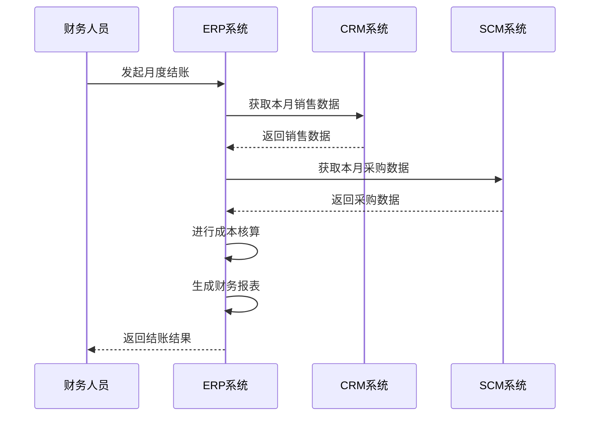
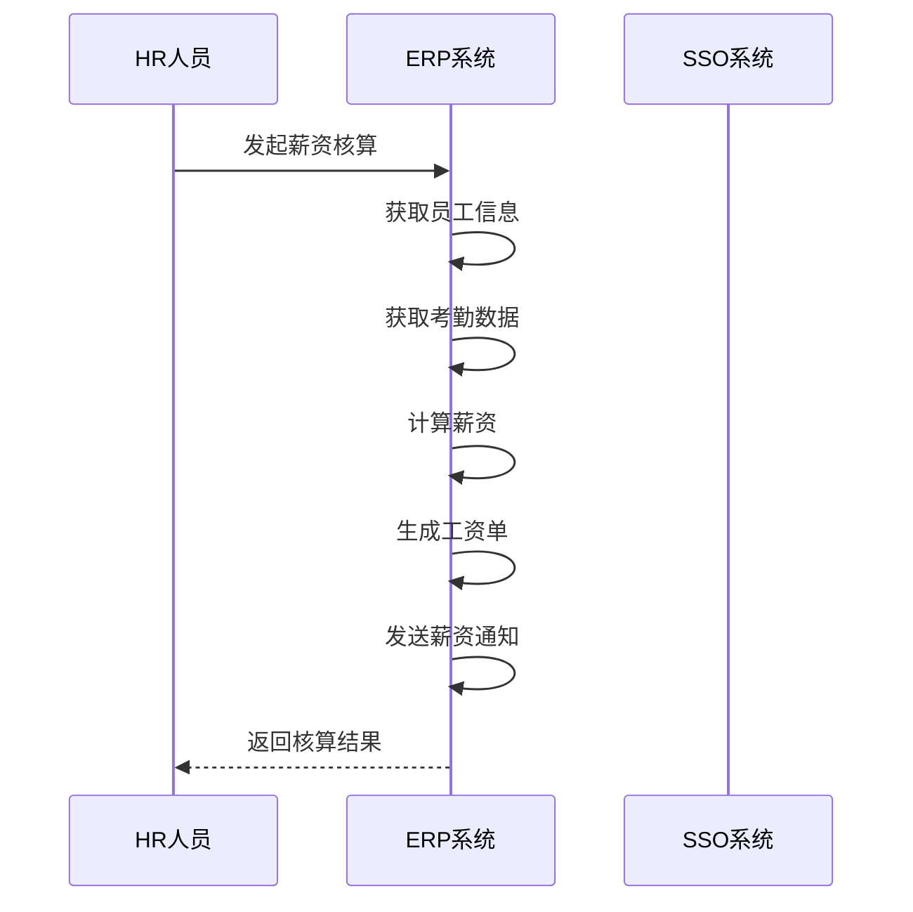
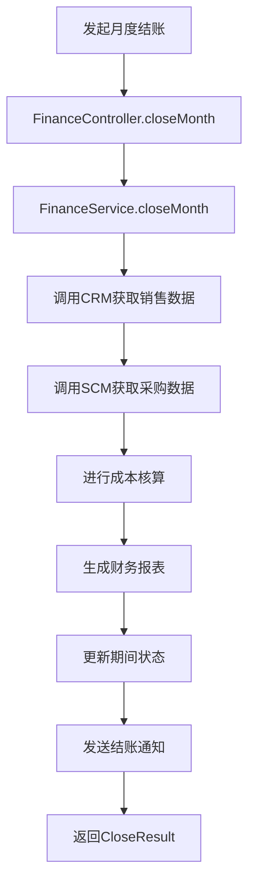
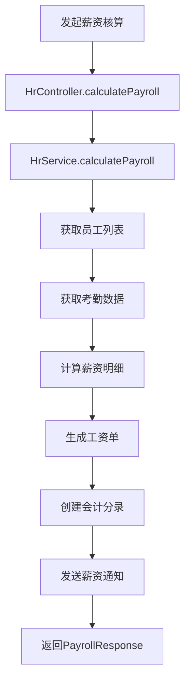

# ERP企业资源计划系统设计文档

## 1. 文档概述

### 1.1 文档目的
本文档详细描述ERP（Enterprise Resource Planning）企业资源计划系统的设计方案，包括系统架构、功能模块、API接口、数据模型等，为系统开发和部署提供技术依据。

### 1.2 系统定位
ERP系统作为企业级应用体系的核心资源管理平台，负责财务管理、人力资源管理、生产管理和项目管理，实现企业资源的全面整合和优化配置。

### 1.3 文档版本
| 版本 | 日期 | 作者 | 变更说明 |
| --- | --- | --- | --- |
| V1.0 | 2026-06-03 | 架构组 | 初始版本 |

---

## 2. 需求分析

### 2.1 功能需求

| 序号 | 需求点 | 需求描述 | 优先级 |
| --- | --- | --- | --- |
| 1 | 财务管理 | 总账管理、应收应付、成本核算 | 高 |
| 2 | 人力资源 | 员工管理、考勤管理、薪资核算 | 高 |
| 3 | 生产管理 | 生产计划、工单管理、产能管理 | 高 |
| 4 | 项目管理 | 项目立项、进度跟踪、成本控制 | 高 |
| 5 | 资产管理 | 固定资产管理、折旧计算 | 中 |
| 6 | 报表中心 | 财务报表、经营分析报表 | 中 |
| 7 | 预算管理 | 预算编制、预算控制 | 中 |

### 2.2 非功能需求

| 类别 | 要求 |
| --- | --- |
| 性能 | 响应时间 < 300ms，支持500+并发用户 |
| 可用性 | 99.9%高可用 |
| 安全性 | 符合等保2.0三级要求 |
| 扩展性 | 支持多组织架构、多币种 |

---

## 3. 系统架构设计

### 3.1 架构风格
- **微服务架构**: 独立部署，高内聚低耦合
- **事件驱动**: 通过消息队列实现系统间解耦

### 3.2 模块划分

| 模块 | 职责 | 说明 |
| --- | --- | --- |
| 财务模块 | 财务管理 | 总账、应收、应付、成本 |
| HR模块 | 人力资源管理 | 员工、考勤、薪资 |
| 生产模块 | 生产管理 | 生产计划、工单 |
| 项目模块 | 项目管理 | 项目跟踪、成本控制 |
| 资产模块 | 资产管理 | 固定资产、折旧 |
| 报表模块 | 数据分析 | 各类报表生成 |

### 3.3 核心流程图

#### 3.3.1 财务结账流程



#### 3.3.2 薪资核算流程



---

## 4. 目录结构

```plaintext
backend/                              # 后端服务
  ├── src/
  │   ├── main/
  │   │   ├── java/com/example/erp/
  │   │   │   ├── controller/         # REST API控制层
  │   │   │   │   ├── FinanceController.java    # 财务管理
  │   │   │   │   ├── HrController.java         # 人力资源
  │   │   │   │   ├── ProductionController.java # 生产管理
  │   │   │   │   ├── ProjectController.java    # 项目管理
  │   │   │   │   ├── AssetController.java      # 资产管理
  │   │   │   │   └── ReportController.java     # 报表分析
  │   │   │   ├── service/            # 业务逻辑层
  │   │   │   │   ├── FinanceService.java
  │   │   │   │   ├── HrService.java
  │   │   │   │   ├── ProductionService.java
  │   │   │   │   ├── ProjectService.java
  │   │   │   │   ├── AssetService.java
  │   │   │   │   └── ReportService.java
  │   │   │   ├── repository/         # 数据访问层
  │   │   │   │   ├── AccountRepository.java
  │   │   │   │   ├── EmployeeRepository.java
  │   │   │   │   ├── ProductionOrderRepository.java
  │   │   │   │   ├── ProjectRepository.java
  │   │   │   │   └── AssetRepository.java
  │   │   │   ├── entity/             # 数据库实体
  │   │   │   │   ├── Account.java
  │   │   │   │   ├── Employee.java
  │   │   │   │   ├── ProductionOrder.java
  │   │   │   │   ├── Project.java
  │   │   │   │   └── Asset.java
  │   │   │   ├── dto/                # 数据传输对象
  │   │   │   │   ├── request/
  │   │   │   │   └── response/
  │   │   │   ├── config/             # 配置类
  │   │   │   │   ├── SecurityConfig.java
  │   │   │   │   └── FeignConfig.java
  │   │   │   ├── client/             # 外部服务调用
  │   │   │   │   ├── CrmClient.java
  │   │   │   │   └── ScmClient.java
  │   │   │   ├── exception/          # 异常处理
  │   │   │   │   └── GlobalExceptionHandler.java
  │   │   │   └── ErpApplication.java # 启动类
  │   └── resources/
  │       ├── application.yml         # 应用配置
  │       └── schema.sql              # 数据库初始化脚本
  └── pom.xml                         # Maven配置

frontend/                             # 前端管理后台
  ├── src/
  │   ├── components/                 # 公共组件
  │   ├── views/                      # 页面
  │   │   ├── finance/                # 财务管理
  │   │   │   ├── ledger.vue
  │   │   │   └── payable.vue
  │   │   ├── hr/                     # 人力资源
  │   │   │   ├── employee.vue
  │   │   │   └── payroll.vue
  │   │   ├── production/             # 生产管理
  │   │   │   └── order.vue
  │   │   ├── project/                # 项目管理
  │   │   │   └── list.vue
  │   │   ├── asset/                  # 资产管理
  │   │   │   └── list.vue
  │   │   └── report/                 # 报表中心
  │   │       └── dashboard.vue
  │   ├── api/                        # API封装
  │   ├── store/                      # 状态管理
  │   └── main.ts                     # 入口文件
  └── package.json                    # 依赖配置
```

---

## 5. 关键类与方法设计

### 5.1 核心服务类

#### 5.1.1 FinanceService (财务服务)

| 方法名 | 功能说明 | 参数 | 返回值 | 失败返回 |
| --- | --- | --- | --- | --- |
| `createAccountEntry` | 创建会计分录 | `AccountEntryRequest request` | `AccountEntryResponse` | 抛出`BusinessException` |
| `generateMonthlyReport` | 生成月度报表 | `String month` | `MonthlyReportResponse` | - |
| `closeMonth` | 月度结账 | `String month` | `CloseResult` | 抛出`CloseException` |
| `getAccountsReceivable` | 查询应收账款 | `AccountSearchRequest request` | `Page<ReceivableResponse>` | - |
| `getAccountsPayable` | 查询应付账款 | `AccountSearchRequest request` | `Page<PayableResponse>` | - |

#### 5.1.2 HrService (人力资源服务)

| 方法名 | 功能说明 | 参数 | 返回值 | 失败返回 |
| --- | --- | --- | --- | --- |
| `createEmployee` | 创建员工 | `EmployeeCreateRequest request` | `EmployeeResponse` | 抛出`BusinessException` |
| `calculatePayroll` | 核算薪资 | `PayrollRequest request` | `PayrollResponse` | - |
| `getAttendance` | 查询考勤 | `AttendanceSearchRequest request` | `Page<AttendanceResponse>` | - |
| `updateAttendance` | 更新考勤 | `Long id, AttendanceUpdateRequest request` | `AttendanceResponse` | 抛出`AttendanceNotFoundException` |

#### 5.1.3 ProductionService (生产服务)

| 方法名 | 功能说明 | 参数 | 返回值 | 失败返回 |
| --- | --- | --- | --- | --- |
| `createProductionOrder` | 创建生产工单 | `ProductionOrderCreateRequest request` | `ProductionOrderResponse` | 抛出`BusinessException` |
| `updateOrderStatus` | 更新工单状态 | `Long id, String status` | `ProductionOrderResponse` | 抛出`OrderNotFoundException` |
| `getProductionOrders` | 查询工单列表 | `ProductionOrderSearchRequest request` | `Page<ProductionOrderResponse>` | - |

### 5.2 DTO结构定义

#### 5.2.1 请求DTO

**AccountEntryRequest（会计分录请求）**
| 字段名 | 类型 | 含义 | 约束 |
| --- | --- | --- | --- |
| accountId | Long | 科目ID | 非空 |
| amount | BigDecimal | 金额 | 非空 |
| direction | String | 方向(DEBIT/CREDIT) | 非空 |
| date | LocalDate | 日期 | 非空 |
| description | String | 摘要 | 可选 |
| sourceType | String | 来源类型 | 可选 |
| sourceId | Long | 来源ID | 可选 |

**EmployeeCreateRequest（创建员工请求）**
| 字段名 | 类型 | 含义 | 约束 |
| --- | --- | --- | --- |
| employeeNo | String | 员工编号 | 非空，唯一 |
| name | String | 姓名 | 非空 |
| department | String | 部门 | 非空 |
| position | String | 职位 | 非空 |
| email | String | 邮箱 | 可选 |
| phone | String | 电话 | 可选 |
| hireDate | LocalDate | 入职日期 | 非空 |
| salary | BigDecimal | 基本工资 | 非空 |

**ProductionOrderCreateRequest（创建生产工单请求）**
| 字段名 | 类型 | 含义 | 约束 |
| --- | --- | --- | --- |
| orderNo | String | 工单号 | 非空，唯一 |
| productId | Long | 产品ID | 非空 |
| quantity | Integer | 生产数量 | 非空，大于0 |
| startDate | LocalDate | 开始日期 | 非空 |
| endDate | LocalDate | 结束日期 | 可选 |
| workshopId | Long | 车间ID | 非空 |

#### 5.2.2 响应DTO

**AccountEntryResponse（会计分录响应）**
| 字段名 | 类型 | 含义 |
| --- | --- | --- |
| id | Long | 分录ID |
| accountId | Long | 科目ID |
| accountName | String | 科目名称 |
| amount | BigDecimal | 金额 |
| direction | String | 方向 |
| date | LocalDate | 日期 |
| description | String | 摘要 |
| createdAt | LocalDateTime | 创建时间 |

**EmployeeResponse（员工响应）**
| 字段名 | 类型 | 含义 |
| --- | --- | --- |
| id | Long | 员工ID |
| employeeNo | String | 员工编号 |
| name | String | 姓名 |
| department | String | 部门 |
| position | String | 职位 |
| email | String | 邮箱 |
| phone | String | 电话 |
| hireDate | LocalDate | 入职日期 |
| salary | BigDecimal | 基本工资 |
| status | String | 状态 |
| createdAt | LocalDateTime | 创建时间 |

**ProductionOrderResponse（生产工单响应）**
| 字段名 | 类型 | 含义 |
| --- | --- | --- |
| id | Long | 工单ID |
| orderNo | String | 工单号 |
| productName | String | 产品名称 |
| quantity | Integer | 生产数量 |
| completedQuantity | Integer | 完成数量 |
| status | String | 状态 |
| startDate | LocalDate | 开始日期 |
| endDate | LocalDate | 结束日期 |
| workshopName | String | 车间名称 |
| createdAt | LocalDateTime | 创建时间 |

---

## 6. 数据库与数据结构设计

### 6.1 数据库表设计

#### 6.1.1 会计科目表 (erp_account)

| 字段名 | 类型 | 约束 | 说明 |
| --- | --- | --- | --- |
| id | BIGINT | PRIMARY KEY, AUTO_INCREMENT | 科目ID |
| code | VARCHAR(50) | UNIQUE, NOT NULL | 科目编码 |
| name | VARCHAR(100) | NOT NULL | 科目名称 |
| type | VARCHAR(20) | NOT NULL | 科目类型 |
| parent_id | BIGINT | FOREIGN KEY | 父科目ID |
| description | VARCHAR(255) | - | 描述 |
| created_at | DATETIME | NOT NULL | 创建时间 |
| updated_at | DATETIME | NOT NULL | 更新时间 |

#### 6.1.2 会计分录表 (erp_account_entry)

| 字段名 | 类型 | 约束 | 说明 |
| --- | --- | --- | --- |
| id | BIGINT | PRIMARY KEY, AUTO_INCREMENT | 分录ID |
| account_id | BIGINT | FOREIGN KEY, NOT NULL | 科目ID |
| amount | DECIMAL(15,2) | NOT NULL | 金额 |
| direction | VARCHAR(10) | NOT NULL | 借贷方向 |
| date | DATE | NOT NULL | 日期 |
| description | VARCHAR(255) | - | 摘要 |
| source_type | VARCHAR(50) | - | 来源类型 |
| source_id | BIGINT | - | 来源ID |
| created_by | BIGINT | NOT NULL | 创建人ID |
| created_at | DATETIME | NOT NULL | 创建时间 |

#### 6.1.3 员工表 (erp_employee)

| 字段名 | 类型 | 约束 | 说明 |
| --- | --- | --- | --- |
| id | BIGINT | PRIMARY KEY, AUTO_INCREMENT | 员工ID |
| employee_no | VARCHAR(50) | UNIQUE, NOT NULL | 员工编号 |
| name | VARCHAR(100) | NOT NULL | 姓名 |
| department | VARCHAR(100) | NOT NULL | 部门 |
| position | VARCHAR(50) | NOT NULL | 职位 |
| email | VARCHAR(100) | - | 邮箱 |
| phone | VARCHAR(20) | - | 电话 |
| hire_date | DATE | NOT NULL | 入职日期 |
| salary | DECIMAL(12,2) | NOT NULL | 基本工资 |
| status | VARCHAR(20) | DEFAULT 'ACTIVE' | 状态 |
| created_at | DATETIME | NOT NULL | 创建时间 |
| updated_at | DATETIME | NOT NULL | 更新时间 |

#### 6.1.4 考勤表 (erp_attendance)

| 字段名 | 类型 | 约束 | 说明 |
| --- | --- | --- | --- |
| id | BIGINT | PRIMARY KEY, AUTO_INCREMENT | 考勤ID |
| employee_id | BIGINT | FOREIGN KEY, NOT NULL | 员工ID |
| date | DATE | NOT NULL | 日期 |
| check_in_time | TIME | - | 上班时间 |
| check_out_time | TIME | - | 下班时间 |
| status | VARCHAR(20) | NOT NULL | 状态 |
| created_at | DATETIME | NOT NULL | 创建时间 |

#### 6.1.5 生产工表单 (erp_production_order)

| 字段名 | 类型 | 约束 | 说明 |
| --- | --- | --- | --- |
| id | BIGINT | PRIMARY KEY, AUTO_INCREMENT | 工单ID |
| order_no | VARCHAR(50) | UNIQUE, NOT NULL | 工单号 |
| product_id | BIGINT | FOREIGN KEY, NOT NULL | 产品ID |
| quantity | INT | NOT NULL | 生产数量 |
| completed_quantity | INT | DEFAULT 0 | 完成数量 |
| status | VARCHAR(20) | NOT NULL | 状态 |
| start_date | DATE | NOT NULL | 开始日期 |
| end_date | DATE | - | 结束日期 |
| workshop_id | BIGINT | FOREIGN KEY, NOT NULL | 车间ID |
| created_by | BIGINT | NOT NULL | 创建人ID |
| created_at | DATETIME | NOT NULL | 创建时间 |
| updated_at | DATETIME | NOT NULL | 更新时间 |

#### 6.1.6 项目表 (erp_project)

| 字段名 | 类型 | 约束 | 说明 |
| --- | --- | --- | --- |
| id | BIGINT | PRIMARY KEY, AUTO_INCREMENT | 项目ID |
| project_no | VARCHAR(50) | UNIQUE, NOT NULL | 项目编号 |
| name | VARCHAR(200) | NOT NULL | 项目名称 |
| description | TEXT | - | 项目描述 |
| status | VARCHAR(20) | NOT NULL | 状态 |
| budget | DECIMAL(15,2) | NOT NULL | 预算金额 |
| actual_cost | DECIMAL(15,2) | DEFAULT 0 | 实际成本 |
| start_date | DATE | NOT NULL | 开始日期 |
| end_date | DATE | - | 结束日期 |
| manager_id | BIGINT | FOREIGN KEY | 项目经理ID |
| created_at | DATETIME | NOT NULL | 创建时间 |
| updated_at | DATETIME | NOT NULL | 更新时间 |

---

## 7. API接口设计

### 7.1 财务管理接口

| API路径 | HTTP方法 | Controller文件 | 功能描述 |
| --- | --- | --- | --- |
| `/api/finance/entries` | GET | FinanceController.java | 查询会计分录 |
| `/api/finance/entries` | POST | FinanceController.java | 创建会计分录 |
| `/api/finance/receivable` | GET | FinanceController.java | 查询应收账款 |
| `/api/finance/payable` | GET | FinanceController.java | 查询应付账款 |
| `/api/finance/reports/monthly` | GET | FinanceController.java | 获取月度报表 |
| `/api/finance/close` | POST | FinanceController.java | 月度结账 |

#### 7.1.1 POST /api/finance/entries

**请求体:**
```json
{
    "accountId": 1,
    "amount": 1000.00,
    "direction": "DEBIT",
    "date": "2024-06-01",
    "description": "销售收款",
    "sourceType": "SALES_ORDER",
    "sourceId": 1001
}
```

**成功响应 (201):**
```json
{
    "code": 201,
    "message": "创建成功",
    "data": {
        "id": 1,
        "accountId": 1,
        "accountName": "应收账款",
        "amount": 1000.00,
        "direction": "DEBIT",
        "date": "2024-06-01",
        "description": "销售收款",
        "createdAt": "2024-06-03T10:30:00"
    }
}
```

### 7.2 人力资源接口

| API路径 | HTTP方法 | Controller文件 | 功能描述 |
| --- | --- | --- | --- |
| `/api/hr/employees` | GET | HrController.java | 查询员工列表 |
| `/api/hr/employees/{id}` | GET | HrController.java | 查询员工详情 |
| `/api/hr/employees` | POST | HrController.java | 创建员工 |
| `/api/hr/employees/{id}` | PUT | HrController.java | 更新员工 |
| `/api/hr/attendance` | GET | HrController.java | 查询考勤 |
| `/api/hr/payroll/calculate` | POST | HrController.java | 核算薪资 |

### 7.3 生产管理接口

| API路径 | HTTP方法 | Controller文件 | 功能描述 |
| --- | --- | --- | --- |
| `/api/production/orders` | GET | ProductionController.java | 查询工单列表 |
| `/api/production/orders/{id}` | GET | ProductionController.java | 查询工单详情 |
| `/api/production/orders` | POST | ProductionController.java | 创建工单 |
| `/api/production/orders/{id}/status` | PUT | ProductionController.java | 更新工单状态 |

### 7.4 项目管理接口

| API路径 | HTTP方法 | Controller文件 | 功能描述 |
| --- | --- | --- | --- |
| `/api/projects` | GET | ProjectController.java | 查询项目列表 |
| `/api/projects/{id}` | GET | ProjectController.java | 查询项目详情 |
| `/api/projects` | POST | ProjectController.java | 创建项目 |
| `/api/projects/{id}` | PUT | ProjectController.java | 更新项目 |
| `/api/projects/{id}/cost` | PUT | ProjectController.java | 更新项目成本 |

---

## 8. 主业务流程与调用链

### 8.1 月度结账流程



### 8.2 薪资核算流程



---

## 9. 安全设计

### 9.1 认证机制
- 通过SSO系统进行统一身份认证
- 使用JWT令牌进行接口访问控制
- 配置OAuth2.0资源服务器

### 9.2 权限控制

| 资源 | 权限 | 说明 |
| --- | --- | --- |
| 财务管理 | finance:read, finance:write | 查看和编辑财务数据 |
| 人力资源 | hr:read, hr:write | 查看和编辑员工信息 |
| 生产管理 | production:read, production:write | 查看和编辑工单 |
| 项目管理 | project:read, project:write | 查看和编辑项目 |
| 报表分析 | report:read | 查看报表 |

---

## 10. 部署与集成方案

### 10.1 依赖与环境

| 依赖 | 版本 | 说明 |
| --- | --- | --- |
| Spring Boot | 3.2.x | 后端框架 |
| Spring Security | 6.2.x | 安全框架 |
| PostgreSQL | 15+ | 数据库 |
| Redis | 7.0+ | 缓存 |
| RabbitMQ | 3.12+ | 消息队列 |

### 10.2 配置与运行

#### application.yml 关键配置

```yaml
server:
  port: 8083

spring:
  datasource:
    url: jdbc:postgresql://localhost:5432/erp_db
    username: ${DB_USERNAME:admin}
    password: ${DB_PASSWORD:password}

  data:
    redis:
      host: localhost
      port: 6379

  rabbitmq:
    host: localhost
    port: 5672

security:
  oauth2:
    resourceserver:
      jwt:
        issuer-uri: https://sso.example.com

feign:
  clients:
    crm-service:
      url: https://crm.example.com
    scm-service:
      url: https://scm.example.com
```

### 10.3 与其他系统集成

| 系统 | 集成方式 | 说明 |
| --- | --- | --- |
| SSO | OAuth2.0 | 统一身份认证 |
| CRM | REST API + 消息队列 | 获取销售数据、同步财务信息 |
| SCM | REST API + 消息队列 | 获取采购数据、同步成本信息 |

---

**文档结束**