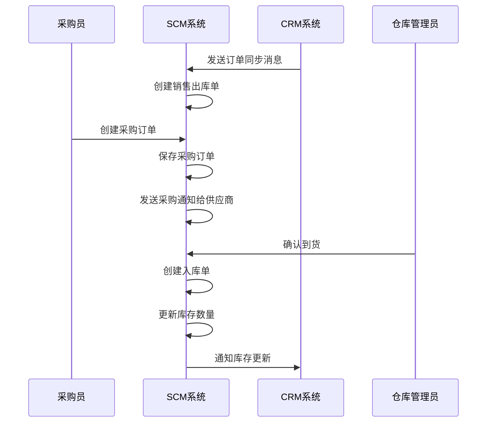
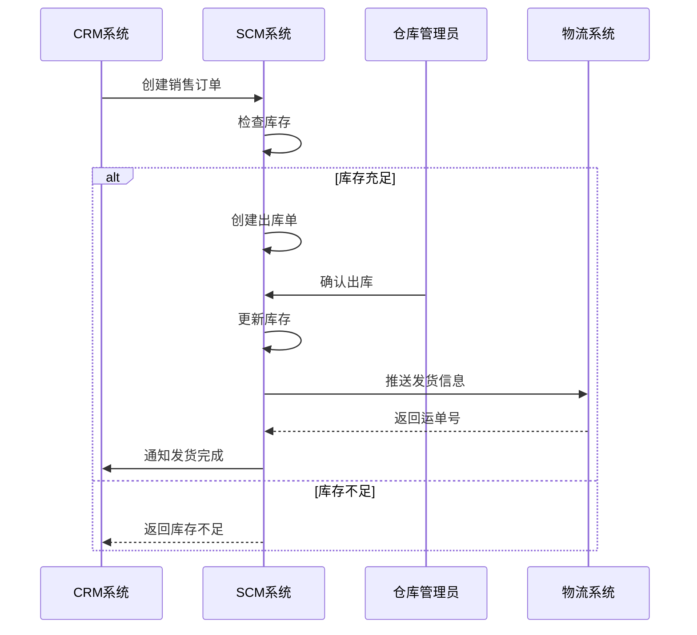
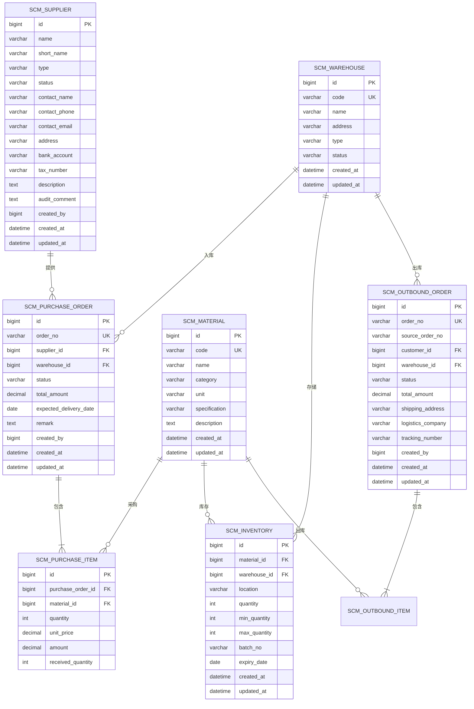
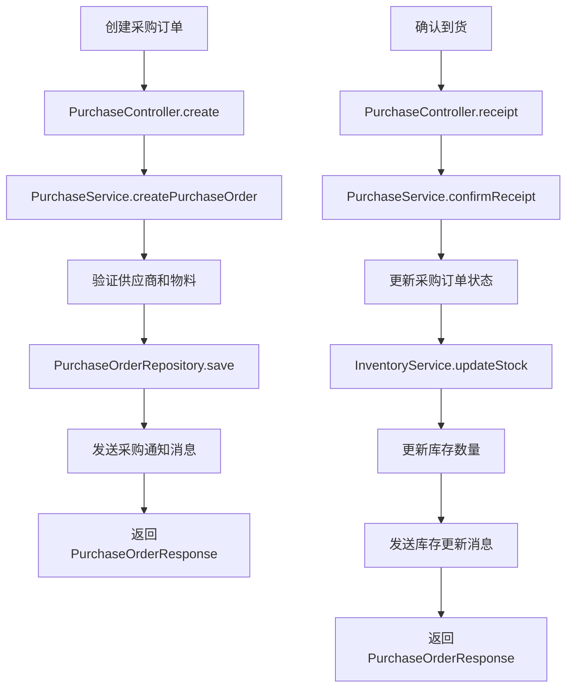
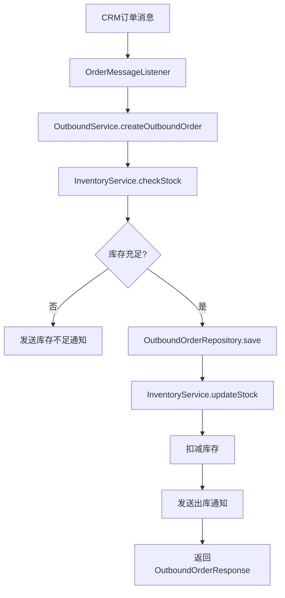

# SCM供应链管理系统设计文档

## 1. 文档概述

### 1.1 文档目的
本文档详细描述SCM（Supply Chain Management）供应链管理系统的设计方案，包括系统架构、功能模块、API接口、数据模型等，为系统开发和部署提供技术依据。

### 1.2 系统定位
SCM系统作为企业级应用体系的核心供应链管理平台，负责采购管理、库存管理、供应商管理和物流配送，实现供应链全流程的可视化和高效协同。

### 1.3 文档版本
| 版本 | 日期 | 作者 | 变更说明 |
| --- | --- | --- | --- |
| V1.0 | 2026-06-03 | 架构组 | 初始版本 |

---

## 2. 需求分析

### 2.1 功能需求

| 序号 | 需求点 | 需求描述 | 优先级 |
| --- | --- | --- | --- |
| 1 | 供应商管理 | 供应商信息管理、资质审核、绩效评估 | 高 |
| 2 | 采购管理 | 采购计划、采购订单、采购入库 | 高 |
| 3 | 库存管理 | 库存查询、库存预警、库存盘点 | 高 |
| 4 | 销售出库 | 销售订单出库、发货管理、物流跟踪 | 高 |
| 5 | 物料管理 | 物料分类、物料编码、BOM管理 | 高 |
| 6 | 仓库管理 | 仓库信息、库位管理、批次管理 | 高 |
| 7 | 报表分析 | 采购报表、库存报表、供应商绩效报表 | 中 |
| 8 | 条码管理 | 条码生成、扫码出入库 | 中 |

### 2.2 非功能需求

| 类别 | 要求 |
| --- | --- |
| 性能 | 响应时间 < 200ms，支持500+并发用户 |
| 可用性 | 99.9%高可用 |
| 安全性 | 符合等保2.0三级要求 |
| 扩展性 | 支持多仓库、多组织架构 |

---

## 3. 系统架构设计

### 3.1 架构风格
- **微服务架构**: 独立部署，高内聚低耦合
- **事件驱动**: 通过消息队列实现系统间解耦

### 3.2 模块划分

| 模块 | 职责 | 说明 |
| --- | --- | --- |
| 供应商模块 | 供应商管理 | 供应商信息、资质、绩效 |
| 采购模块 | 采购管理 | 采购计划、采购订单、采购入库 |
| 库存模块 | 库存管理 | 库存查询、预警、盘点 |
| 出库模块 | 销售出库 | 出库单、发货、物流 |
| 物料模块 | 物料管理 | 物料、BOM、条码 |
| 仓库模块 | 仓库管理 | 仓库、库位、批次 |
| 报表模块 | 数据分析 | 各类报表生成 |

### 3.3 核心流程图

#### 3.3.1 采购入库流程



#### 3.3.2 销售出库流程



---

## 4. 目录结构

```plaintext
backend/                              # 后端服务
  ├── src/
  │   ├── main/
  │   │   ├── java/com/example/scm/
  │   │   │   ├── controller/         # REST API控制层
  │   │   │   │   ├── SupplierController.java   # 供应商管理
  │   │   │   │   ├── PurchaseController.java   # 采购管理
  │   │   │   │   ├── InventoryController.java  # 库存管理
  │   │   │   │   ├── OutboundController.java   # 出库管理
  │   │   │   │   ├── MaterialController.java   # 物料管理
  │   │   │   │   ├── WarehouseController.java  # 仓库管理
  │   │   │   │   └── ReportController.java     # 报表分析
  │   │   │   ├── service/            # 业务逻辑层
  │   │   │   │   ├── SupplierService.java
  │   │   │   │   ├── PurchaseService.java
  │   │   │   │   ├── InventoryService.java
  │   │   │   │   ├── OutboundService.java
  │   │   │   │   ├── MaterialService.java
  │   │   │   │   ├── WarehouseService.java
  │   │   │   │   └── ReportService.java
  │   │   │   ├── repository/         # 数据访问层
  │   │   │   │   ├── SupplierRepository.java
  │   │   │   │   ├── PurchaseOrderRepository.java
  │   │   │   │   ├── InventoryRepository.java
  │   │   │   │   ├── OutboundOrderRepository.java
  │   │   │   │   ├── MaterialRepository.java
  │   │   │   │   └── WarehouseRepository.java
  │   │   │   ├── entity/             # 数据库实体
  │   │   │   │   ├── Supplier.java
  │   │   │   │   ├── PurchaseOrder.java
  │   │   │   │   ├── PurchaseItem.java
  │   │   │   │   ├── Inventory.java
  │   │   │   │   ├── OutboundOrder.java
  │   │   │   │   ├── OutboundItem.java
  │   │   │   │   ├── Material.java
  │   │   │   │   ├── Bom.java
  │   │   │   │   └── Warehouse.java
  │   │   │   ├── dto/                # 数据传输对象
  │   │   │   │   ├── request/
  │   │   │   │   └── response/
  │   │   │   ├── config/             # 配置类
  │   │   │   │   ├── SecurityConfig.java
  │   │   │   │   └── FeignConfig.java
  │   │   │   ├── client/             # 外部服务调用
  │   │   │   │   └── CrmClient.java
  │   │   │   ├── listener/           # 消息监听器
  │   │   │   │   └── OrderMessageListener.java
  │   │   │   ├── exception/          # 异常处理
  │   │   │   │   └── GlobalExceptionHandler.java
  │   │   │   └── ScmApplication.java # 启动类
  │   └── resources/
  │       ├── application.yml         # 应用配置
  │       └── schema.sql              # 数据库初始化脚本
  └── pom.xml                         # Maven配置

frontend/                             # 前端管理后台
  ├── src/
  │   ├── components/                 # 公共组件
  │   ├── views/                      # 页面
  │   │   ├── supplier/               # 供应商管理
  │   │   │   ├── list.vue
  │   │   │   └── detail.vue
  │   │   ├── purchase/               # 采购管理
  │   │   │   ├── order.vue
  │   │   │   └── inbound.vue
  │   │   ├── inventory/              # 库存管理
  │   │   │   ├── list.vue
  │   │   │   └── warning.vue
  │   │   ├── outbound/               # 出库管理
  │   │   │   └── order.vue
  │   │   ├── material/               # 物料管理
  │   │   │   └── list.vue
  │   │   ├── warehouse/              # 仓库管理
  │   │   │   └── list.vue
  │   │   └── report/                 # 报表中心
  │   │       └── dashboard.vue
  │   ├── api/                        # API封装
  │   ├── store/                      # 状态管理
  │   └── main.ts                     # 入口文件
  └── package.json                    # 依赖配置
```

---

## 5. 关键类与方法设计

### 5.1 核心服务类

#### 5.1.1 SupplierService (供应商服务)

| 方法名 | 功能说明 | 参数 | 返回值 | 失败返回 |
| --- | --- | --- | --- | --- |
| `createSupplier` | 创建供应商 | `SupplierCreateRequest request` | `SupplierResponse` | 抛出`BusinessException` |
| `updateSupplier` | 更新供应商 | `Long id, SupplierUpdateRequest request` | `SupplierResponse` | 抛出`SupplierNotFoundException` |
| `deleteSupplier` | 删除供应商 | `Long id` | `void` | 抛出`SupplierNotFoundException` |
| `getSupplierById` | 查询供应商详情 | `Long id` | `SupplierResponse` | 抛出`SupplierNotFoundException` |
| `searchSuppliers` | 搜索供应商 | `SupplierSearchRequest request` | `Page<SupplierResponse>` | - |
| `auditSupplier` | 审核供应商 | `Long id, String status, String comment` | `SupplierResponse` | 抛出`SupplierNotFoundException` |

#### 5.1.2 PurchaseService (采购服务)

| 方法名 | 功能说明 | 参数 | 返回值 | 失败返回 |
| --- | --- | --- | --- | --- |
| `createPurchaseOrder` | 创建采购订单 | `PurchaseOrderCreateRequest request` | `PurchaseOrderResponse` | 抛出`BusinessException` |
| `updatePurchaseOrder` | 更新采购订单 | `Long id, PurchaseOrderUpdateRequest request` | `PurchaseOrderResponse` | 抛出`PurchaseOrderNotFoundException` |
| `confirmReceipt` | 确认到货 | `Long id, ReceiptRequest request` | `PurchaseOrderResponse` | 抛出`PurchaseOrderNotFoundException` |
| `getPurchaseOrders` | 查询采购订单列表 | `PurchaseOrderSearchRequest request` | `Page<PurchaseOrderResponse>` | - |

#### 5.1.3 InventoryService (库存服务)

| 方法名 | 功能说明 | 参数 | 返回值 | 失败返回 |
| --- | --- | --- | --- | --- |
| `getInventory` | 查询库存 | `InventorySearchRequest request` | `Page<InventoryResponse>` | - |
| `getInventoryByMaterial` | 按物料查询库存 | `Long materialId` | `List<InventoryResponse>` | - |
| `updateStock` | 更新库存并发布事件 | `Long inventoryId, Integer quantity, String operationType` | `InventoryResponse` | 抛出`InventoryNotFoundException` |
| `checkStock` | 检查库存 | `Long materialId, Integer quantity` | `Boolean` | - |
| `generateWarningList` | 生成库存预警列表 | `-` | `List<InventoryWarning>` | - |
| `publishStockEvent` | 发布库存变更事件 | `StockEvent event` | `void` | - |

### 5.2 DTO结构定义

#### 5.2.1 请求DTO

**SupplierCreateRequest（创建供应商请求）**
| 字段名 | 类型 | 含义 | 约束 |
| --- | --- | --- | --- |
| name | String | 供应商名称 | 非空 |
| shortName | String | 供应商简称 | 可选 |
| type | String | 供应商类型 | 非空 |
| contactName | String | 联系人姓名 | 非空 |
| contactPhone | String | 联系电话 | 非空 |
| contactEmail | String | 邮箱 | 可选，邮箱格式 |
| address | String | 地址 | 可选 |
| bankAccount | String | 银行账户 | 可选 |
| taxNumber | String | 税号 | 可选 |
| description | String | 备注说明 | 可选 |

**PurchaseOrderCreateRequest（创建采购订单请求）**
| 字段名 | 类型 | 含义 | 约束 |
| --- | --- | --- | --- |
| supplierId | Long | 供应商ID | 非空 |
| warehouseId | Long | 入库仓库ID | 非空 |
| items | List<PurchaseItemRequest> | 采购商品列表 | 非空 |
| expectedDeliveryDate | LocalDate | 预计到货日期 | 可选 |
| remark | String | 备注 | 可选 |

**OutboundOrderCreateRequest（创建出库订单请求）**
| 字段名 | 类型 | 含义 | 约束 |
| --- | --- | --- | --- |
| orderNo | String | 关联销售订单号 | 可选 |
| customerId | Long | 客户ID | 可选 |
| warehouseId | Long | 出库仓库ID | 非空 |
| items | List<OutboundItemRequest> | 出库商品列表 | 非空 |
| shippingAddress | String | 收货地址 | 非空 |
| logisticsCompany | String | 物流公司 | 可选 |

**StockEvent（库存变更事件）**
| 字段名 | 类型 | 含义 | 约束 |
| --- | --- | --- | --- |
| eventId | String | 事件ID | 非空 |
| eventType | String | 事件类型(IN/OUT/ADJUST) | 非空 |
| materialId | Long | 物料ID | 非空 |
| materialCode | String | 物料编码 | 非空 |
| warehouseId | Long | 仓库ID | 非空 |
| quantity | Integer | 变更数量 | 非空 |
| beforeQuantity | Integer | 变更前数量 | 非空 |
| afterQuantity | Integer | 变更后数量 | 非空 |
| batchNo | String | 批次号 | 可选 |
| sourceOrderNo | String | 来源订单号 | 可选 |
| createdAt | LocalDateTime | 创建时间 | 非空 |

#### 5.2.2 响应DTO

**SupplierResponse（供应商响应）**
| 字段名 | 类型 | 含义 |
| --- | --- | --- |
| id | Long | 供应商ID |
| name | String | 供应商名称 |
| shortName | String | 供应商简称 |
| type | String | 供应商类型 |
| status | String | 状态(待审核/已通过/已拒绝) |
| contactName | String | 联系人姓名 |
| contactPhone | String | 联系电话 |
| contactEmail | String | 邮箱 |
| address | String | 地址 |
| bankAccount | String | 银行账户 |
| taxNumber | String | 税号 |
| createdAt | LocalDateTime | 创建时间 |
| updatedAt | LocalDateTime | 更新时间 |

**PurchaseOrderResponse（采购订单响应）**
| 字段名 | 类型 | 含义 |
| --- | --- | --- |
| id | Long | 订单ID |
| orderNo | String | 订单编号 |
| supplierName | String | 供应商名称 |
| warehouseName | String | 入库仓库 |
| items | List<PurchaseItemResponse> | 采购商品列表 |
| totalAmount | BigDecimal | 订单总额 |
| status | String | 订单状态 |
| expectedDeliveryDate | LocalDate | 预计到货日期 |
| createdAt | LocalDateTime | 创建时间 |
| updatedAt | LocalDateTime | 更新时间 |

**InventoryResponse（库存响应）**
| 字段名 | 类型 | 含义 |
| --- | --- | --- |
| id | Long | 库存ID |
| materialId | Long | 物料ID |
| materialCode | String | 物料编码 |
| materialName | String | 物料名称 |
| warehouseId | Long | 仓库ID |
| warehouseName | String | 仓库名称 |
| location | String | 库位 |
| quantity | Integer | 库存数量 |
| minQuantity | Integer | 最低库存 |
| maxQuantity | Integer | 最高库存 |
| batchNo | String | 批次号 |
| expiryDate | LocalDate | 有效期 |
| createdAt | LocalDateTime | 创建时间 |
| updatedAt | LocalDateTime | 更新时间 |

---

## 6. 数据库与数据结构设计

### 6.1 数据库表设计

#### 6.1.1 供应商表 (scm_supplier)

| 字段名 | 类型 | 约束 | 说明 |
| --- | --- | --- | --- |
| id | BIGINT | PRIMARY KEY, AUTO_INCREMENT | 供应商ID |
| name | VARCHAR(200) | NOT NULL | 供应商名称 |
| short_name | VARCHAR(50) | - | 供应商简称 |
| type | VARCHAR(20) | NOT NULL | 供应商类型 |
| status | VARCHAR(20) | DEFAULT 'PENDING' | 状态 |
| contact_name | VARCHAR(50) | NOT NULL | 联系人姓名 |
| contact_phone | VARCHAR(20) | NOT NULL | 联系电话 |
| contact_email | VARCHAR(100) | - | 邮箱 |
| address | VARCHAR(500) | - | 地址 |
| bank_account | VARCHAR(100) | - | 银行账户 |
| tax_number | VARCHAR(50) | - | 税号 |
| description | TEXT | - | 备注说明 |
| audit_comment | TEXT | - | 审核意见 |
| created_by | BIGINT | NOT NULL | 创建人ID |
| created_at | DATETIME | NOT NULL | 创建时间 |
| updated_at | DATETIME | NOT NULL | 更新时间 |

#### 6.1.2 采购订单表 (scm_purchase_order)

| 字段名 | 类型 | 约束 | 说明 |
| --- | --- | --- | --- |
| id | BIGINT | PRIMARY KEY, AUTO_INCREMENT | 订单ID |
| order_no | VARCHAR(50) | UNIQUE, NOT NULL | 订单编号 |
| supplier_id | BIGINT | FOREIGN KEY, NOT NULL | 供应商ID |
| warehouse_id | BIGINT | FOREIGN KEY, NOT NULL | 入库仓库ID |
| status | VARCHAR(20) | NOT NULL | 订单状态 |
| total_amount | DECIMAL(15,2) | NOT NULL | 订单总额 |
| expected_delivery_date | DATE | - | 预计到货日期 |
| remark | TEXT | - | 备注 |
| created_by | BIGINT | NOT NULL | 创建人ID |
| created_at | DATETIME | NOT NULL | 创建时间 |
| updated_at | DATETIME | NOT NULL | 更新时间 |

#### 6.1.3 采购订单明细表 (scm_purchase_item)

| 字段名 | 类型 | 约束 | 说明 |
| --- | --- | --- | --- |
| id | BIGINT | PRIMARY KEY, AUTO_INCREMENT | 明细ID |
| purchase_order_id | BIGINT | FOREIGN KEY, NOT NULL | 关联采购订单ID |
| material_id | BIGINT | FOREIGN KEY, NOT NULL | 物料ID |
| quantity | INT | NOT NULL | 采购数量 |
| unit_price | DECIMAL(10,2) | NOT NULL | 单价 |
| amount | DECIMAL(15,2) | NOT NULL | 金额 |
| received_quantity | INT | DEFAULT 0 | 已收货数量 |

#### 6.1.4 库存表 (scm_inventory)

| 字段名 | 类型 | 约束 | 说明 |
| --- | --- | --- | --- |
| id | BIGINT | PRIMARY KEY, AUTO_INCREMENT | 库存ID |
| material_id | BIGINT | FOREIGN KEY, NOT NULL | 物料ID |
| warehouse_id | BIGINT | FOREIGN KEY, NOT NULL | 仓库ID |
| location | VARCHAR(50) | NOT NULL | 库位 |
| quantity | INT | DEFAULT 0 | 库存数量 |
| min_quantity | INT | DEFAULT 0 | 最低库存 |
| max_quantity | INT | DEFAULT 1000 | 最高库存 |
| batch_no | VARCHAR(50) | - | 批次号 |
| expiry_date | DATE | - | 有效期 |
| created_at | DATETIME | NOT NULL | 创建时间 |
| updated_at | DATETIME | NOT NULL | 更新时间 |

#### 6.1.5 出库订单表 (scm_outbound_order)

| 字段名 | 类型 | 约束 | 说明 |
| --- | --- | --- | --- |
| id | BIGINT | PRIMARY KEY, AUTO_INCREMENT | 订单ID |
| order_no | VARCHAR(50) | UNIQUE, NOT NULL | 订单编号 |
| source_order_no | VARCHAR(50) | - | 来源订单号(CRM订单) |
| customer_id | BIGINT | FOREIGN KEY | 客户ID |
| warehouse_id | BIGINT | FOREIGN KEY, NOT NULL | 出库仓库ID |
| status | VARCHAR(20) | NOT NULL | 订单状态 |
| total_amount | DECIMAL(15,2) | NOT NULL | 订单总额 |
| shipping_address | VARCHAR(500) | NOT NULL | 收货地址 |
| logistics_company | VARCHAR(50) | - | 物流公司 |
| tracking_number | VARCHAR(50) | - | 运单号 |
| created_by | BIGINT | NOT NULL | 创建人ID |
| created_at | DATETIME | NOT NULL | 创建时间 |
| updated_at | DATETIME | NOT NULL | 更新时间 |

#### 6.1.6 物料表 (scm_material)

| 字段名 | 类型 | 约束 | 说明 |
| --- | --- | --- | --- |
| id | BIGINT | PRIMARY KEY, AUTO_INCREMENT | 物料ID |
| code | VARCHAR(50) | UNIQUE, NOT NULL | 物料编码 |
| name | VARCHAR(200) | NOT NULL | 物料名称 |
| category | VARCHAR(50) | NOT NULL | 物料分类 |
| unit | VARCHAR(20) | NOT NULL | 计量单位 |
| specification | VARCHAR(200) | - | 规格型号 |
| description | TEXT | - | 备注说明 |
| created_at | DATETIME | NOT NULL | 创建时间 |
| updated_at | DATETIME | NOT NULL | 更新时间 |

#### 6.1.7 仓库表 (scm_warehouse)

| 字段名 | 类型 | 约束 | 说明 |
| --- | --- | --- | --- |
| id | BIGINT | PRIMARY KEY, AUTO_INCREMENT | 仓库ID |
| code | VARCHAR(50) | UNIQUE, NOT NULL | 仓库编码 |
| name | VARCHAR(100) | NOT NULL | 仓库名称 |
| address | VARCHAR(500) | - | 仓库地址 |
| type | VARCHAR(20) | NOT NULL | 仓库类型 |
| status | VARCHAR(20) | DEFAULT 'ACTIVE' | 状态 |
| created_at | DATETIME | NOT NULL | 创建时间 |
| updated_at | DATETIME | NOT NULL | 更新时间 |

### 6.2 ER图



---

## 7. API接口设计

### 7.1 供应商管理接口

| API路径 | HTTP方法 | Controller文件 | 功能描述 |
| --- | --- | --- | --- |
| `/api/suppliers` | GET | SupplierController.java | 查询供应商列表 |
| `/api/suppliers/{id}` | GET | SupplierController.java | 查询供应商详情 |
| `/api/suppliers` | POST | SupplierController.java | 创建供应商 |
| `/api/suppliers/{id}` | PUT | SupplierController.java | 更新供应商 |
| `/api/suppliers/{id}` | DELETE | SupplierController.java | 删除供应商 |
| `/api/suppliers/{id}/audit` | POST | SupplierController.java | 审核供应商 |

#### 7.1.1 POST /api/suppliers

**请求体:**
```json
{
    "name": "示例供应商有限公司",
    "shortName": "示例供应商",
    "type": "MANUFACTURER",
    "contactName": "张三",
    "contactPhone": "13800138000",
    "contactEmail": "zhang@example.com",
    "address": "上海市浦东新区",
    "bankAccount": "1234567890",
    "taxNumber": "91310000XXXXXXXXX",
    "description": "示例供应商描述"
}
```

**成功响应 (201):**
```json
{
    "code": 201,
    "message": "创建成功",
    "data": {
        "id": 1,
        "name": "示例供应商有限公司",
        "shortName": "示例供应商",
        "type": "MANUFACTURER",
        "status": "PENDING",
        "contactName": "张三",
        "contactPhone": "13800138000",
        "contactEmail": "zhang@example.com",
        "address": "上海市浦东新区",
        "bankAccount": "1234567890",
        "taxNumber": "91310000XXXXXXXXX",
        "createdAt": "2024-06-03T10:30:00",
        "updatedAt": "2024-06-03T10:30:00"
    }
}
```

### 7.2 采购管理接口

| API路径 | HTTP方法 | Controller文件 | 功能描述 |
| --- | --- | --- | --- |
| `/api/purchase/orders` | GET | PurchaseController.java | 查询采购订单列表 |
| `/api/purchase/orders/{id}` | GET | PurchaseController.java | 查询采购订单详情 |
| `/api/purchase/orders` | POST | PurchaseController.java | 创建采购订单 |
| `/api/purchase/orders/{id}` | PUT | PurchaseController.java | 更新采购订单 |
| `/api/purchase/orders/{id}/receipt` | POST | PurchaseController.java | 确认到货 |

### 7.3 库存管理接口

| API路径 | HTTP方法 | Controller文件 | 功能描述 |
| --- | --- | --- | --- |
| `/api/inventory` | GET | InventoryController.java | 查询库存列表 |
| `/api/inventory/{id}` | GET | InventoryController.java | 查询库存详情 |
| `/api/inventory/{id}/adjust` | PUT | InventoryController.java | 调整库存 |
| `/api/inventory/warning` | GET | InventoryController.java | 获取库存预警列表 |
| `/api/inventory/check` | POST | InventoryController.java | 检查库存 |

### 7.4 出库管理接口

| API路径 | HTTP方法 | Controller文件 | 功能描述 |
| --- | --- | --- | --- |
| `/api/outbound/orders` | GET | OutboundController.java | 查询出库订单列表 |
| `/api/outbound/orders/{id}` | GET | OutboundController.java | 查询出库订单详情 |
| `/api/outbound/orders` | POST | OutboundController.java | 创建出库订单 |
| `/api/outbound/orders/{id}/ship` | POST | OutboundController.java | 确认发货 |

### 7.5 物料管理接口

| API路径 | HTTP方法 | Controller文件 | 功能描述 |
| --- | --- | --- | --- |
| `/api/materials` | GET | MaterialController.java | 查询物料列表 |
| `/api/materials/{id}` | GET | MaterialController.java | 查询物料详情 |
| `/api/materials` | POST | MaterialController.java | 创建物料 |
| `/api/materials/{id}` | PUT | MaterialController.java | 更新物料 |
| `/api/materials/{id}` | DELETE | MaterialController.java | 删除物料 |

---

## 8. 主业务流程与调用链

### 8.1 采购入库流程



### 8.2 销售出库流程



### 8.3 调用链明细表

#### 采购入库调用链

| 步骤 | 类名 | 方法名 | 文件路径 |
| --- | --- | --- | --- |
| 1 | PurchaseController | receipt | controller/PurchaseController.java |
| 2 | PurchaseService | confirmReceipt | service/PurchaseService.java |
| 3 | PurchaseOrderRepository | findById | repository/PurchaseOrderRepository.java |
| 4 | InventoryService | updateStock | service/InventoryService.java |
| 5 | InventoryRepository | findById | repository/InventoryRepository.java |
| 6 | InventoryRepository | save | repository/InventoryRepository.java |
| 7 | MessageService | sendInventoryUpdate | service/MessageService.java |

---

## 9. 安全设计

### 9.1 认证机制
- 通过SSO系统进行统一身份认证
- 使用JWT令牌进行接口访问控制
- 配置OAuth2.0资源服务器

### 9.2 权限控制

| 资源 | 权限 | 说明 |
| --- | --- | --- |
| 供应商管理 | supplier:read, supplier:write, supplier:audit | 查看、编辑、审核供应商 |
| 采购管理 | purchase:read, purchase:write | 查看、创建采购订单 |
| 库存管理 | inventory:read, inventory:write | 查看、调整库存 |
| 出库管理 | outbound:read, outbound:write | 查看、创建出库订单 |
| 物料管理 | material:read, material:write | 查看、编辑物料 |

### 9.3 数据隔离
- 基于仓库的数据隔离
- 支持组织架构权限控制
- 敏感数据脱敏处理

---

## 10. 部署与集成方案

### 10.1 依赖与环境

| 依赖 | 版本 | 说明 |
| --- | --- | --- |
| Spring Boot | 3.2.x | 后端框架 |
| Spring Security | 6.2.x | 安全框架 |
| PostgreSQL | 15+ | 数据库 |
| Redis | 7.0+ | 缓存 |
| RabbitMQ | 3.12+ | 消息队列 |

### 10.2 配置与运行

#### application.yml 关键配置

```yaml
server:
  port: 8082

spring:
  datasource:
    url: jdbc:postgresql://localhost:5432/scm_db
    username: ${DB_USERNAME:admin}
    password: ${DB_PASSWORD:password}
  
  data:
    redis:
      host: localhost
      port: 6379

  rabbitmq:
    host: localhost
    port: 5672
    username: guest
    password: guest

# SSO配置
security:
  oauth2:
    resourceserver:
      jwt:
        issuer-uri: https://sso.example.com

# 外部服务配置
feign:
  clients:
    sso-service:
      url: https://sso.example.com
    crm-service:
      url: https://crm.example.com
```

### 10.3 与其他系统集成

| 系统 | 集成方式 | 说明 |
| --- | --- | --- |
| SSO | OAuth2.0 | 统一身份认证 |
| CRM | REST API + 消息队列 | 订单同步、库存查询 |
| 物流系统 | API | 运单推送、物流跟踪 |

---

**文档结束**