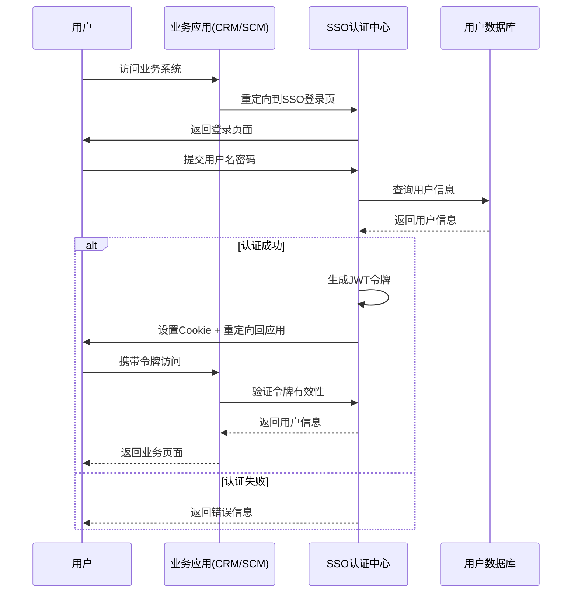
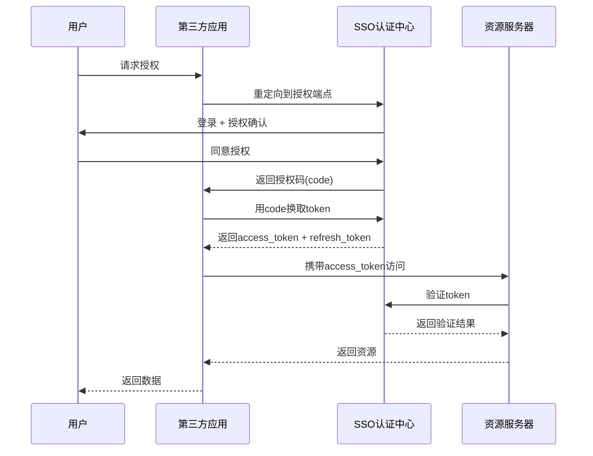
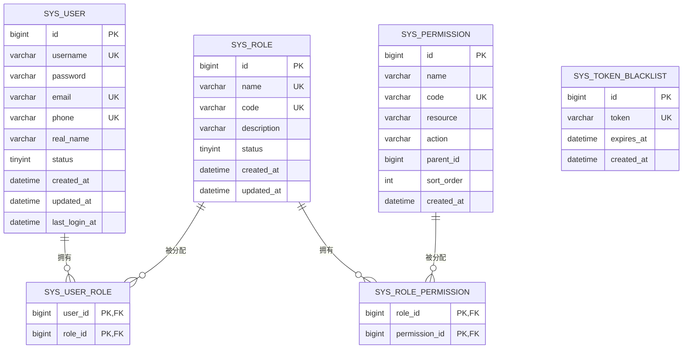
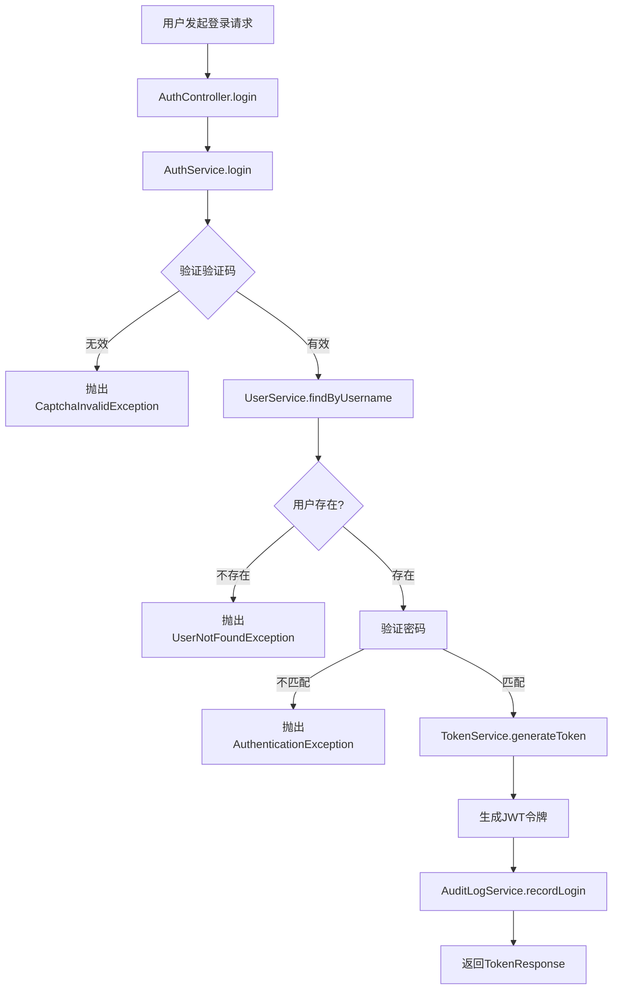
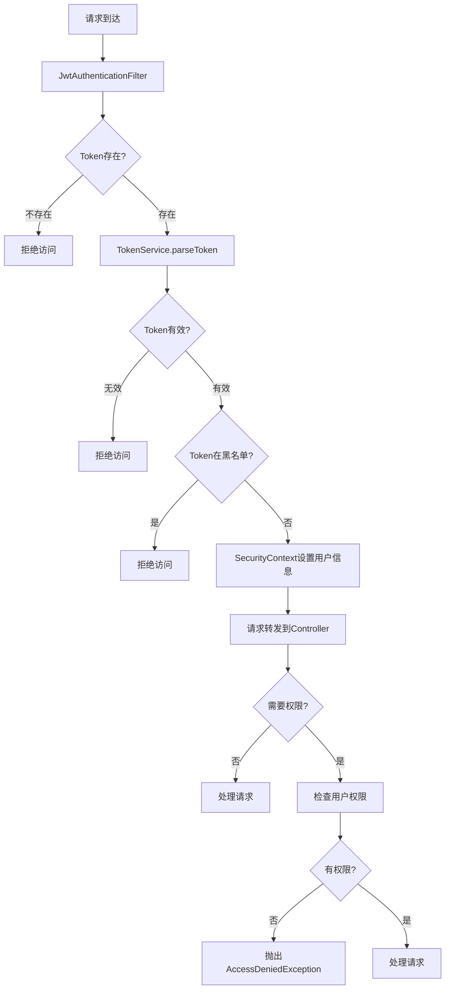

# SSO统一身份认证系统设计文档

## 1. 文档概述

### 1.1 文档目的
本文档详细描述SSO（Single Sign-On）统一身份认证系统的设计方案，包括系统架构、功能模块、API接口、安全机制等，为系统开发和部署提供技术依据。

### 1.2 系统定位
SSO系统作为企业级应用体系的核心身份管理中心，负责统一用户认证、单点登录、权限控制和安全审计。

### 1.3 文档版本
| 版本 | 日期 | 作者 | 变更说明 |
| --- | --- | --- | --- |
| V1.0 | 2026-06-03 | 架构组 | 初始版本 |

---

## 2. 需求分析

### 2.1 功能需求

| 序号 | 需求点 | 需求描述 | 优先级 |
| --- | --- | --- | --- |
| 1 | 用户注册 | 支持企业用户和外部用户注册 | 高 |
| 2 | 用户登录 | 支持多种认证方式（账号密码、验证码、MFA） | 高 |
| 3 | 单点登录 | 一次认证，多系统访问 | 高 |
| 4 | 权限管理 | 基于角色的权限控制(RBAC) | 高 |
| 5 | 令牌管理 | JWT令牌生成、刷新、吊销 | 高 |
| 6 | 安全审计 | 登录日志、操作日志记录 | 高 |
| 7 | 多因素认证 | 支持短信/邮件/硬件令牌MFA | 中 |
| 8 | 第三方认证 | 支持OAuth2.0/SAML2.0集成 | 中 |

### 2.2 非功能需求

| 类别 | 要求 |
| --- | --- |
| 性能 | 认证响应时间 < 100ms，支持10000+ TPS |
| 可用性 | 99.99%高可用 |
| 安全性 | 符合等保2.0三级，支持数据加密 |
| 扩展性 | 支持水平扩展，支持多租户 |

---

## 3. 系统架构设计

### 3.1 架构风格
- **微服务架构**: 独立部署，高内聚低耦合
- **无状态设计**: 基于JWT令牌，服务端不存储会话状态

### 3.2 模块划分

| 模块 | 职责 | 说明 |
| --- | --- | --- |
| 认证模块 | 用户登录、认证处理 | 处理各类认证请求 |
| 授权模块 | 权限验证、角色管理 | RBAC权限控制 |
| 令牌模块 | JWT生成、刷新、吊销 | 令牌生命周期管理 |
| 用户模块 | 用户信息管理 | 用户CRUD操作 |
| 审计模块 | 日志记录、安全审计 | 操作日志追踪 |
| 配置模块 | 系统配置管理 | 认证策略配置 |

### 3.3 核心流程图

#### 3.3.1 单点登录流程



#### 3.3.2 OAuth2.0授权码流程



---

## 4. 目录结构

```plaintext
backend/                              # 后端服务
  ├── src/
  │   ├── main/
  │   │   ├── java/com/example/sso/
  │   │   │   ├── controller/         # REST API控制层
  │   │   │   │   ├── AuthController.java    # 认证接口
  │   │   │   │   ├── UserController.java    # 用户管理接口
  │   │   │   │   ├── RoleController.java    # 角色管理接口
  │   │   │   │   └── TokenController.java   # 令牌管理接口
  │   │   │   ├── service/            # 业务逻辑层
  │   │   │   │   ├── AuthService.java       # 认证服务
  │   │   │   │   ├── UserService.java       # 用户服务
  │   │   │   │   ├── RoleService.java       # 角色服务
  │   │   │   │   └── TokenService.java      # 令牌服务
  │   │   │   ├── repository/         # 数据访问层
  │   │   │   │   ├── UserRepository.java
  │   │   │   │   ├── RoleRepository.java
  │   │   │   │   ├── PermissionRepository.java
  │   │   │   │   └── TokenBlacklistRepository.java
  │   │   │   ├── entity/             # 数据库实体
  │   │   │   │   ├── User.java
  │   │   │   │   ├── Role.java
  │   │   │   │   ├── Permission.java
  │   │   │   │   └── TokenBlacklist.java
  │   │   │   ├── dto/                # 数据传输对象
  │   │   │   │   ├── request/        # 请求DTO
  │   │   │   │   └── response/       # 响应DTO
  │   │   │   ├── config/             # 配置类
  │   │   │   │   ├── SecurityConfig.java
  │   │   │   │   ├── JwtConfig.java
  │   │   │   │   └── CorsConfig.java
  │   │   │   ├── security/           # 安全组件
  │   │   │   │   ├── JwtTokenProvider.java
  │   │   │   │   ├── CustomUserDetailsService.java
  │   │   │   │   └── FilterChainExceptionHandler.java
  │   │   │   ├── exception/          # 异常处理
  │   │   │   │   ├── GlobalExceptionHandler.java
  │   │   │   │   └── BusinessException.java
  │   │   │   ├── audit/              # 审计模块
  │   │   │   │   └── AuditLogService.java
  │   │   │   └── SsoApplication.java # 启动类
  │   └── resources/
  │       ├── application.yml         # 应用配置
  │       └── schema.sql              # 数据库初始化脚本
  └── pom.xml                         # Maven配置

frontend/                             # 前端管理后台
  ├── src/
  │   ├── components/                 # 组件
  │   ├── views/                      # 页面
  │   │   ├── login.vue               # 登录页
  │   │   ├── user-manage.vue         # 用户管理
  │   │   ├── role-manage.vue         # 角色管理
  │   │   └── audit-log.vue           # 审计日志
  │   ├── api/                        # API封装
  │   ├── store/                      # 状态管理
  │   └── main.ts                     # 入口文件
  └── package.json                    # 依赖配置
```

---

## 5. 关键类与方法设计

### 5.1 核心服务类

#### 5.1.1 AuthService (认证服务)

| 方法名 | 功能说明 | 参数 | 返回值 | 失败返回 |
| --- | --- | --- | --- | --- |
| `login` | 用户登录 | `LoginRequest request` | `TokenResponse` | 抛出`AuthenticationException` |
| `logout` | 用户登出 | `String token` | `void` | 抛出`TokenInvalidException` |
| `refreshToken` | 刷新令牌 | `RefreshTokenRequest request` | `TokenResponse` | 抛出`TokenExpiredException` |
| `verifyToken` | 验证令牌 | `String token` | `UserInfo` | 抛出`TokenInvalidException` |
| `register` | 用户注册 | `RegisterRequest request` | `UserResponse` | 抛出`UserExistException` |

#### 5.1.2 TokenService (令牌服务)

| 方法名 | 功能说明 | 参数 | 返回值 | 失败返回 |
| --- | --- | --- | --- | --- |
| `generateToken` | 生成JWT令牌 | `UserDetails userDetails` | `TokenResponse` | - |
| `parseToken` | 解析令牌 | `String token` | `Claims` | 抛出`TokenInvalidException` |
| `revokeToken` | 吊销令牌 | `String token` | `void` | - |
| `isTokenBlacklisted` | 检查令牌是否在黑名单 | `String token` | `boolean` | - |

#### 5.1.3 RoleService (角色服务)

| 方法名 | 功能说明 | 参数 | 返回值 | 失败返回 |
| --- | --- | --- | --- | --- |
| `createRole` | 创建角色 | `RoleCreateRequest request` | `RoleResponse` | 抛出`RoleExistException` |
| `updateRole` | 更新角色 | `Long id, RoleUpdateRequest request` | `RoleResponse` | 抛出`RoleNotFoundException` |
| `deleteRole` | 删除角色 | `Long id` | `void` | 抛出`RoleNotFoundException` |
| `getRolePermissions` | 获取角色权限 | `Long roleId` | `List<Permission>` | - |
| `assignPermissions` | 分配权限 | `Long roleId, List<Long> permissionIds` | `void` | - |

### 5.2 DTO结构定义

#### 5.2.1 请求DTO

**LoginRequest（登录请求）**
| 字段名 | 类型 | 含义 | 约束 |
| --- | --- | --- | --- |
| username | String | 用户名 | 非空，长度3-50 |
| password | String | 密码 | 非空，长度6-128 |
| captcha | String | 验证码 | 可选 |
| rememberMe | Boolean | 是否记住我 | 默认false |

**RegisterRequest（注册请求）**
| 字段名 | 类型 | 含义 | 约束 |
| --- | --- | --- | --- |
| username | String | 用户名 | 非空，唯一 |
| password | String | 密码 | 非空，长度6-128 |
| email | String | 邮箱 | 非空，邮箱格式 |
| phone | String | 手机号 | 可选，手机号格式 |
| realName | String | 真实姓名 | 非空 |

**RefreshTokenRequest（刷新令牌请求）**
| 字段名 | 类型 | 含义 | 约束 |
| --- | --- | --- | --- |
| refreshToken | String | 刷新令牌 | 非空 |

#### 5.2.2 响应DTO

**TokenResponse（令牌响应）**
| 字段名 | 类型 | 含义 |
| --- | --- | --- |
| accessToken | String | 访问令牌 |
| refreshToken | String | 刷新令牌 |
| tokenType | String | 令牌类型(Bearer) |
| expiresIn | Long | 过期时间(秒) |
| userInfo | UserInfo | 用户信息 |

**UserInfo（用户信息）**
| 字段名 | 类型 | 含义 |
| --- | --- | --- |
| id | Long | 用户ID |
| username | String | 用户名 |
| email | String | 邮箱 |
| phone | String | 手机号 |
| realName | String | 真实姓名 |
| roles | List<String> | 角色列表 |
| permissions | List<String> | 权限列表 |

---

## 6. 数据库与数据结构设计

### 6.1 数据库表设计

#### 6.1.1 用户表 (sys_user)

| 字段名 | 类型 | 约束 | 说明 |
| --- | --- | --- | --- |
| id | BIGINT | PRIMARY KEY, AUTO_INCREMENT | 用户ID |
| username | VARCHAR(50) | UNIQUE, NOT NULL | 用户名 |
| password | VARCHAR(255) | NOT NULL | 密码(BCrypt加密) |
| email | VARCHAR(100) | UNIQUE | 邮箱 |
| phone | VARCHAR(20) | UNIQUE | 手机号 |
| real_name | VARCHAR(50) | NOT NULL | 真实姓名 |
| status | TINYINT | DEFAULT 1 | 状态(0禁用,1启用) |
| avatar | VARCHAR(255) | - | 头像URL |
| created_at | DATETIME | NOT NULL | 创建时间 |
| updated_at | DATETIME | NOT NULL | 更新时间 |
| last_login_at | DATETIME | - | 最后登录时间 |

#### 6.1.2 角色表 (sys_role)

| 字段名 | 类型 | 约束 | 说明 |
| --- | --- | --- | --- |
| id | BIGINT | PRIMARY KEY, AUTO_INCREMENT | 角色ID |
| name | VARCHAR(50) | UNIQUE, NOT NULL | 角色名称 |
| code | VARCHAR(50) | UNIQUE, NOT NULL | 角色编码 |
| description | VARCHAR(255) | - | 角色描述 |
| status | TINYINT | DEFAULT 1 | 状态(0禁用,1启用) |
| created_at | DATETIME | NOT NULL | 创建时间 |
| updated_at | DATETIME | NOT NULL | 更新时间 |

#### 6.1.3 权限表 (sys_permission)

| 字段名 | 类型 | 约束 | 说明 |
| --- | --- | --- | --- |
| id | BIGINT | PRIMARY KEY, AUTO_INCREMENT | 权限ID |
| name | VARCHAR(50) | NOT NULL | 权限名称 |
| code | VARCHAR(100) | UNIQUE, NOT NULL | 权限编码 |
| resource | VARCHAR(255) | NOT NULL | 资源路径 |
| action | VARCHAR(20) | NOT NULL | 操作类型(GET/POST/PUT/DELETE) |
| parent_id | BIGINT | DEFAULT 0 | 父权限ID |
| sort_order | INT | DEFAULT 0 | 排序号 |
| created_at | DATETIME | NOT NULL | 创建时间 |

#### 6.1.4 用户角色关联表 (sys_user_role)

| 字段名 | 类型 | 约束 | 说明 |
| --- | --- | --- | --- |
| user_id | BIGINT | FOREIGN KEY | 用户ID |
| role_id | BIGINT | FOREIGN KEY | 角色ID |
| PRIMARY KEY (user_id, role_id) | - | 联合主键 |

#### 6.1.5 角色权限关联表 (sys_role_permission)

| 字段名 | 类型 | 约束 | 说明 |
| --- | --- | --- | --- |
| role_id | BIGINT | FOREIGN KEY | 角色ID |
| permission_id | BIGINT | FOREIGN KEY | 权限ID |
| PRIMARY KEY (role_id, permission_id) | - | 联合主键 |

#### 6.1.6 令牌黑名单表 (sys_token_blacklist)

| 字段名 | 类型 | 约束 | 说明 |
| --- | --- | --- | --- |
| id | BIGINT | PRIMARY KEY, AUTO_INCREMENT | ID |
| token | VARCHAR(500) | UNIQUE, NOT NULL | JWT令牌 |
| expires_at | DATETIME | NOT NULL | 令牌过期时间 |
| created_at | DATETIME | NOT NULL | 添加时间 |

### 6.2 ER图



---

## 7. API接口设计

### 7.1 认证接口

| API路径 | HTTP方法 | Controller文件 | 功能描述 |
| --- | --- | --- | --- |
| `/api/auth/login` | POST | AuthController.java | 用户登录 |
| `/api/auth/logout` | POST | AuthController.java | 用户登出 |
| `/api/auth/refresh` | POST | AuthController.java | 刷新令牌 |
| `/api/auth/register` | POST | AuthController.java | 用户注册 |
| `/api/auth/verify` | GET | AuthController.java | 验证令牌 |
| `/api/auth/captcha` | GET | AuthController.java | 获取验证码 |

#### 7.1.1 POST /api/auth/login

**请求体:**
```json
{
    "username": "admin",
    "password": "password123",
    "captcha": "abc123",
    "rememberMe": false
}
```

**成功响应 (200):**
```json
{
    "code": 200,
    "message": "登录成功",
    "data": {
        "accessToken": "eyJhbGciOiJIUzI1NiIsInR5cCI6IkpXVCJ9...",
        "refreshToken": "eyJhbGciOiJIUzI1NiIsInR5cCI6IkpXVCJ9...",
        "tokenType": "Bearer",
        "expiresIn": 86400,
        "userInfo": {
            "id": 1,
            "username": "admin",
            "email": "admin@example.com",
            "phone": "13800138000",
            "realName": "管理员",
            "roles": ["ADMIN"],
            "permissions": ["user:read", "user:write"]
        }
    }
}
```

**失败响应 (401):**
```json
{
    "code": 401,
    "message": "用户名或密码错误",
    "data": null
}
```

#### 7.1.2 POST /api/auth/logout

**请求头:**
```
Authorization: Bearer <access_token>
```

**成功响应 (200):**
```json
{
    "code": 200,
    "message": "登出成功",
    "data": null
}
```

### 7.2 用户管理接口

| API路径 | HTTP方法 | Controller文件 | 功能描述 |
| --- | --- | --- | --- |
| `/api/users` | GET | UserController.java | 查询用户列表 |
| `/api/users/{id}` | GET | UserController.java | 查询单个用户 |
| `/api/users` | POST | UserController.java | 创建用户 |
| `/api/users/{id}` | PUT | UserController.java | 更新用户 |
| `/api/users/{id}` | DELETE | UserController.java | 删除用户 |
| `/api/users/{id}/roles` | PUT | UserController.java | 分配角色 |

#### 7.2.1 GET /api/users

**请求参数:**
| 参数名 | 类型 | 必填 | 说明 |
| --- | --- | --- | --- |
| page | Integer | 否 | 页码，默认0 |
| size | Integer | 否 | 每页数量，默认10 |
| username | String | 否 | 用户名模糊查询 |
| status | Integer | 否 | 状态筛选 |

**成功响应 (200):**
```json
{
    "code": 200,
    "message": "查询成功",
    "data": {
        "content": [
            {
                "id": 1,
                "username": "admin",
                "email": "admin@example.com",
                "phone": "13800138000",
                "realName": "管理员",
                "status": 1,
                "roles": ["ADMIN"],
                "createdAt": "2024-01-01T00:00:00",
                "lastLoginAt": "2024-06-03T10:30:00"
            }
        ],
        "totalElements": 100,
        "totalPages": 10,
        "currentPage": 0
    }
}
```

### 7.3 角色管理接口

| API路径 | HTTP方法 | Controller文件 | 功能描述 |
| --- | --- | --- | --- |
| `/api/roles` | GET | RoleController.java | 查询角色列表 |
| `/api/roles/{id}` | GET | RoleController.java | 查询单个角色 |
| `/api/roles` | POST | RoleController.java | 创建角色 |
| `/api/roles/{id}` | PUT | RoleController.java | 更新角色 |
| `/api/roles/{id}` | DELETE | RoleController.java | 删除角色 |
| `/api/roles/{id}/permissions` | PUT | RoleController.java | 分配权限 |

### 7.4 权限管理接口

| API路径 | HTTP方法 | Controller文件 | 功能描述 |
| --- | --- | --- | --- |
| `/api/permissions` | GET | PermissionController.java | 查询权限列表 |
| `/api/permissions/{id}` | GET | PermissionController.java | 查询单个权限 |
| `/api/permissions` | POST | PermissionController.java | 创建权限 |
| `/api/permissions/{id}` | PUT | PermissionController.java | 更新权限 |
| `/api/permissions/{id}` | DELETE | PermissionController.java | 删除权限 |

---

## 8. 主业务流程与调用链

### 8.1 用户登录流程



### 8.2 权限验证流程



### 8.3 调用链明细表

#### 用户登录调用链

| 步骤 | 类名 | 方法名 | 文件路径 |
| --- | --- | --- | --- |
| 1 | AuthController | login | controller/AuthController.java |
| 2 | AuthService | login | service/AuthService.java |
| 3 | UserService | findByUsername | service/UserService.java |
| 4 | UserRepository | findByUsername | repository/UserRepository.java |
| 5 | TokenService | generateToken | service/TokenService.java |
| 6 | JwtTokenProvider | createToken | security/JwtTokenProvider.java |
| 7 | AuditLogService | recordLogin | audit/AuditLogService.java |

---

## 9. 安全设计

### 9.1 密码安全

| 措施 | 说明 |
| --- | --- |
| 密码加密 | 使用BCrypt算法加密存储 |
| 密码强度 | 要求至少6位，包含大小写字母和数字 |
| 密码策略 | 支持密码过期策略、历史密码检查 |
| 密码重置 | 支持邮箱/短信验证重置 |

### 9.2 令牌安全

| 措施 | 说明 |
| --- | --- |
| JWT签名 | 使用HS256/RS256算法签名 |
| 令牌过期 | Access Token 24小时过期 |
| 刷新机制 | Refresh Token 7天过期 |
| 令牌黑名单 | 登出时加入黑名单 |
| HTTPS传输 | 所有API使用HTTPS |

### 9.3 防护措施

| 措施 | 说明 |
| --- | --- |
| 验证码 | 登录接口启用图形验证码 |
| 登录限制 | 连续失败5次锁定账户15分钟 |
| 会话管理 | 支持并发登录控制 |
| SQL注入防护 | 使用JPA参数化查询 |
| XSS防护 | 输入输出数据过滤 |

### 9.4 安全配置

```yaml
security:
  jwt:
    secret: ${JWT_SECRET:your-256-bit-secret-key}
    access-token-validity-in-seconds: 86400      # 24小时
    refresh-token-validity-in-seconds: 604800   # 7天
  login:
    max-attempts: 5
    lockout-duration-minutes: 15
  cors:
    allowed-origins:
      - https://*.example.com
    allowed-methods:
      - GET
      - POST
      - PUT
      - DELETE
```

---

## 10. 部署与集成方案

### 10.1 依赖与环境

| 依赖 | 版本 | 说明 |
| --- | --- | --- |
| Spring Boot | 3.2.x | 后端框架 |
| Spring Security | 6.2.x | 安全框架 |
| JJWT | 0.12.x | JWT库 |
| MySQL | 8.0+ | 数据库 |
| Redis | 7.0+ | 缓存/令牌黑名单 |

### 10.2 配置与运行

#### application.yml 关键配置

```yaml
server:
  port: 8080

spring:
  datasource:
    url: jdbc:mysql://localhost:3306/example_db?useSSL=false&serverTimezone=UTC
    username: ${DB_USERNAME:admin}
    password: ${DB_PASSWORD:password}
    driver-class-name: com.mysql.cj.jdbc.Driver
  
  data:
    redis:
      host: localhost
      port: 6379
      password: ${REDIS_PASSWORD:}

jwt:
  secret: ${JWT_SECRET}
  access-token-validity-in-seconds: 86400
  refresh-token-validity-in-seconds: 604800
```

#### 启动命令

```bash
# 开发环境
mvn spring-boot:run

# 生产环境
java -jar sso-service.jar --spring.profiles.active=prod
```

### 10.3 与其他系统集成

| 系统 | 集成方式 | 说明 |
| --- | --- | --- |
| CRM | OAuth2.0 | CRM作为OAuth2.0客户端 |
| SCM | OAuth2.0 | SCM作为OAuth2.0客户端 |
| 其他应用 | SAML2.0/OAuth2.0 | 支持多种协议 |

#### OAuth2.0 客户端配置示例

```yaml
oauth2:
  clients:
    crm:
      client-id: crm-client
      client-secret: crm-secret
      redirect-uri: https://crm.example.com/callback
      scopes: openid,profile,email
    scm:
      client-id: scm-client
      client-secret: scm-secret
      redirect-uri: https://scm.example.com/callback
      scopes: openid,profile
```

---

**文档结束**